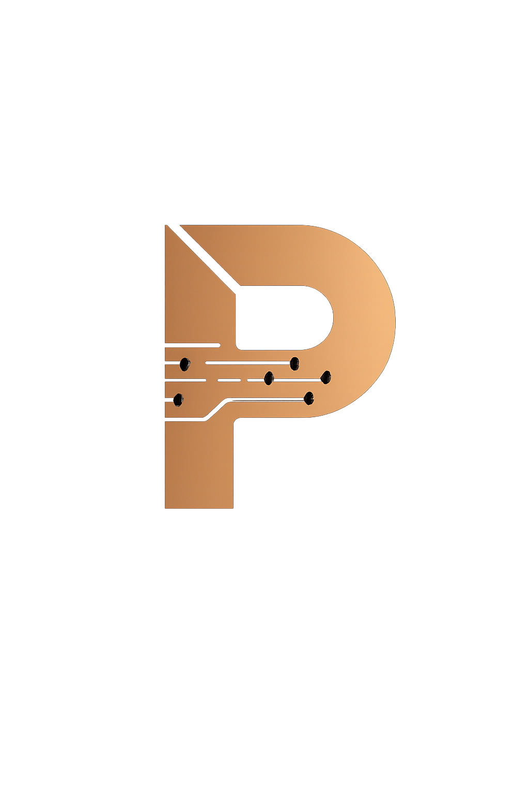

<p align="center">
  
</p>

<h1 align="center">PHAESTUS</h1>

<p align="center"><strong>Forged Intelligence.</strong> Hardware design from natural language.</p>

<p align="center">
  <a href="https://phaestus.pages.dev">Live Demo</a> •
  <a href="#quick-start">Quick Start</a> •
  <a href="#architecture">Architecture</a>
</p>

---

PHAESTUS transforms specifications into manufacturable hardware:
- KiCad schematics and PCB layouts
- Gerber files for manufacturing
- 3D-printable enclosures (OpenSCAD/STL)
- Firmware scaffolding (ESP32/STM32)
- BOM and documentation

## Live Demo

**https://phaestus.pages.dev**

Login: `mike` / `mike`

## Quick Start

```bash
cd frontend
pnpm install
pnpm dev:full    # Full stack with D1/R2 bindings
```

Open http://localhost:8788

## Tech Stack

| Layer | Technology |
|-------|------------|
| **Frontend** | React 19, Vite, TypeScript, TailwindCSS, Zustand |
| **Backend** | Cloudflare Pages Functions |
| **Database** | Cloudflare D1 (SQLite) |
| **Storage** | Cloudflare R2 |
| **LLM** | OpenRouter (Gemini 3.0 Flash) |
| **Testing** | Vitest (90%+ coverage) |

## Architecture

```
┌─────────────────────────────────────────────────────────┐
│                    Cloudflare Edge                       │
├─────────────────────────────────────────────────────────┤
│  Pages (Static)  │  Functions (API)  │  D1  │  R2      │
│  React SPA       │  /api/*           │  DB  │  Assets  │
└─────────────────────────────────────────────────────────┘
                            │
                            ▼
                    ┌───────────────┐
                    │  OpenRouter   │
                    │  (LLM Proxy)  │
                    └───────────────┘
```

## Development

```bash
pnpm install      # Install dependencies
pnpm dev          # Frontend only (port 5173)
pnpm dev:full     # Full stack (port 8788)
pnpm test         # Run tests
pnpm test:coverage # Run with coverage
pnpm typecheck    # Type check
pnpm lint         # Lint
```

## Database

```bash
pnpm db:migrate          # Run migrations locally
pnpm db:migrate:remote   # Run migrations on production D1
pnpm db:reset            # Reset and re-run all migrations
```

## Deployment

```bash
pnpm deploy   # Build and deploy to Cloudflare Pages
```

Secrets are managed via `wrangler pages secret put <NAME>`.

## License

MIT
