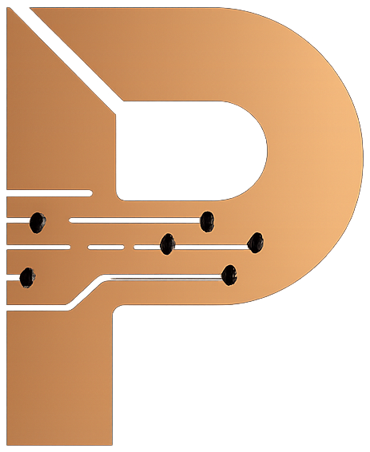

<p align="center">
  
</p>

<h1 align="center">PHAESTUS</h1>

<p align="center"><strong>Forged Intelligence.</strong> Hardware design from natural language.</p>

<p align="center">
  <a href="https://phaestus.app">Live Demo</a> •
  <a href="#features">Features</a> •
  <a href="#quick-start">Quick Start</a> •
  <a href="#architecture">Architecture</a> •
  <a href="#development-blog">Blog</a>
</p>

---

PHAESTUS transforms natural language specifications into manufacturable hardware through a guided design process:

## Features

### Spec Pipeline (5 Steps)
1. **Feasibility Analysis** - Scores your idea across categories (communication, processing, power, I/O)
2. **Refinement** - Surfaces questions to lock down open decisions (2-5 rounds)
3. **Blueprints** - Generates 4 product render variations with iterative feedback
4. **Selection** - Pick your favorite design direction, regenerate with feedback
5. **Finalization** - Generates locked spec with detailed BOM

### Workspace Stages (Post-Spec)
- **PCB Stage** - Block selection from 21+ pre-validated modules, grid-based layout, KiCad schematic merging, board selector for main/cable-connected blocks
- **Enclosure Stage** - OpenSCAD generation, real-time STL preview (WASM), visual validation against blueprints
- **Firmware Stage** - ESP32-C6 code generation (Arduino/PlatformIO), Monaco editor, multi-file support
- **Export Stage** - Download all artifacts (spec, PCB, enclosure, firmware), gallery publishing

### Admin Features
- **Block Library** - Manage 21+ PCB blocks with LLM-assisted import from KiCad files
- **Orchestrator Editor** - Edit 8 specialized agent prompts, visualize workflow DAG, configure hooks
- **LangGraph Debugger** - Visual execution debugging with subgraph selector, thread inspection, graph structure viewer
- **User Management** - Approval workflow, admin status, usage tracking
- **Debug Logs** - Real-time log streaming with filtering by level/category

### Technical Highlights
- **LangGraph Orchestrator** - Hierarchical subgraph architecture with 5 stage subgraphs (spec, pcb, enclosure, firmware, export), checkpointing for resumable workflows
- **Gerber Merging** - Block-based PCB manufacturing via Gerber layer concatenation (replaces complex KiCad S-expression parsing)
- **TOKN Parser** - Custom KiCad S-expression parser for token-optimized hardware representation
- **Formal Block System** - Zod-validated block.json schema with 5 required files (schematic, PCB, STEP, gerbers, block.json)
- **OpenSCAD 2025 WASM** - Real-time STL rendering with Manifold backend
- **KiCad Export Script** - Automated block export to ZIP with gerbers, drill files, and 3D models

## Live Demo

**https://phaestus.app**

Contact: contact@phaestus.app

## Scope

PHAESTUS focuses on hobbyist/maker-level hardware:

**Supported**: ESP32-C6, common sensors (BME280, PIR, etc.), WS2812B LEDs, OLED displays, motor drivers, LiPo/USB/DC power

**Hard Rejections**: FPGA, high voltage (>24V), safety-critical, healthcare/medical, complex RF, precision analog

## Quick Start

```bash
cd frontend
pnpm install
pnpm dev:full    # Full stack with D1/R2 bindings
```

Open http://localhost:8788

## Tech Stack

| Layer | Technology |
|-------|------------|
| **Frontend** | React 19, Vite, TypeScript, TailwindCSS 4, Zustand |
| **Backend** | Cloudflare Pages Functions |
| **Database** | Cloudflare D1 (SQLite, 18 migrations) |
| **Storage** | Cloudflare R2 |
| **LLM** | OpenRouter / Google Gemini |
| **Testing** | Vitest (585 tests, ~65% coverage) |

## Architecture

```
┌─────────────────────────────────────────────────────────┐
│                    Cloudflare Edge                       │
├─────────────────────────────────────────────────────────┤
│  Pages (Static)  │  Functions (API)  │  D1  │  R2      │
│  React SPA       │  /api/* (40+)     │  DB  │  Assets  │
└─────────────────────────────────────────────────────────┘
                            │
              ┌─────────────┼─────────────┐
              ▼             ▼             ▼
      ┌───────────┐ ┌───────────┐ ┌───────────┐
      │ OpenRouter│ │  Gemini   │ │   TOKN    │
      │ (LLM)     │ │  (Images) │ │  Parser   │
      └───────────┘ └───────────┘ └───────────┘
```

## Development

```bash
pnpm install      # Install dependencies
pnpm dev          # Frontend only (port 5173)
pnpm dev:full     # Full stack (port 8788)
pnpm test         # Run tests (watch mode)
pnpm test:run     # Run tests (single run)
pnpm check        # Full CI check (typecheck + test + build)
```

## Database

```bash
pnpm db:migrate          # Run migrations locally
pnpm db:migrate:remote   # Run migrations on production D1
pnpm db:reset            # Reset and re-run all migrations
```

## Deployment

```bash
pnpm deploy   # Build and deploy to Cloudflare Pages
```

CI/CD via GitHub Actions on push to `main`.

## Security

- Bcrypt password hashing (auto-migrates from plaintext)
- Session-based auth with 7-day sliding expiry
- WorkOS AuthKit OAuth integration
- User approval workflow
- Rate limiting on login (5 attempts/15min, 30min lockout)
- Request size limits (10MB general, 5MB for specs)
- Input validation (2000 char max)
- LLM retry with exponential backoff
- Cost tracking for all LLM requests

## API Endpoints (40+)

| Category | Endpoints |
|----------|-----------|
| Auth | login, logout, me, OAuth callback |
| Projects | CRUD, conversations, visibility |
| LLM | chat, image, stream, tools |
| Blocks | list, details, file serving |
| Admin | logs, users, blocks, orchestrator |
| Gallery | public list, public details |

## Development Blog

PHAESTUS includes a development blog documenting the build process with 44 technical posts.

**Live**: https://phaestus.app/blog

**Structure**:
```
frontend/
├── public/blogs/
│   ├── blog0001/
│   │   ├── blog.md          # Markdown content
│   │   └── screenshot.png   # Images
│   ├── blog0044/            # Latest: Cloud Firmware Compilation
│   │   └── ...
└── src/data/
    └── blog-manifest.json   # Index of all posts
```

**Adding a Post**:
1. Create `frontend/public/blogs/blogXXXX/blog.md`
2. Add images to the same directory
3. Update `frontend/src/data/blog-manifest.json` with entry metadata

## License

MIT
