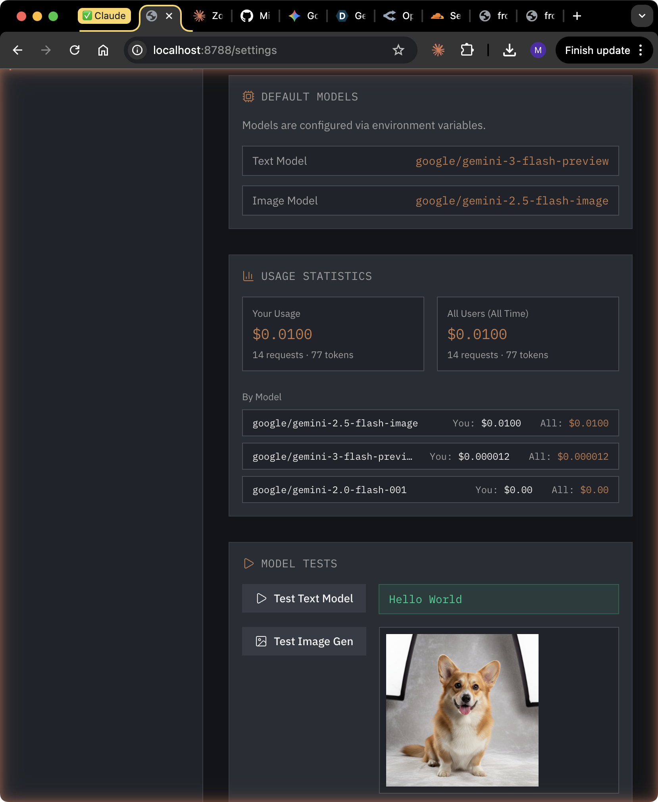

# LLM Cost Tracking: Know What You're Spending

**Date:** 2025-12-30

---

## The Problem

We're building an AI-powered hardware design tool. Every requirements extraction, block selection, and design iteration costs money. Without visibility into costs:

- Development burns through API credits unknowingly
- No way to identify expensive operations for optimization
- Multi-user deployments can't allocate costs

## The Solution

Added per-request cost tracking with real-time usage statistics visible in Settings.



---

## Implementation

### Database Schema

Added `cost_usd` column to the existing `llm_requests` table:

```sql
ALTER TABLE llm_requests ADD COLUMN cost_usd REAL DEFAULT 0;
```

Every LLM request now logs:
- Model used
- Prompt/completion tokens
- Latency
- Calculated cost in USD
- User ID for multi-user tracking

### Pricing Engine

Created a pricing utility (`functions/api/llm/pricing.ts`) with per-model rates:

```typescript
const MODEL_PRICING: Record<string, ModelPricing> = {
  'google/gemini-3-flash-preview': { promptPer1M: 0.15, completionPer1M: 0.6 },
  'google/gemini-2.5-flash-image': { promptPer1M: 0.15, completionPer1M: 0.6 },
  'anthropic/claude-3.5-sonnet': { promptPer1M: 3.0, completionPer1M: 15.0 },
  // ... more models
}

export function calculateCost(model: string, promptTokens: number, completionTokens: number): number {
  const pricing = MODEL_PRICING[model] || MODEL_PRICING['default']
  return (promptTokens / 1_000_000) * pricing.promptPer1M +
         (completionTokens / 1_000_000) * pricing.completionPer1M
}
```

Image generation uses fixed per-image pricing:

```typescript
export function calculateImageCost(model: string): number {
  if (model.includes('gemini')) return 0.002  // $0.002 per image
  if (model.includes('dall-e-3')) return 0.04
  return 0.01
}
```

### Usage API

New endpoint `GET /api/settings/usage` returns aggregated stats:

```typescript
{
  user: {
    byModel: [
      { model: "google/gemini-2.5-flash-image", requestCount: 5, totalCost: 0.01 },
      { model: "google/gemini-3-flash-preview", requestCount: 8, totalCost: 0.000012 }
    ],
    totals: { requestCount: 13, totalTokens: 89, totalCost: 0.010012 }
  },
  all: {
    byModel: [...],
    totals: { requestCount: 13, totalTokens: 89, totalCost: 0.010012 }
  }
}
```

Separates "Your Usage" from "All Users (All Time)" for multi-tenant deployments.

### Settings UI

The Settings page now displays:

1. **Summary cards** - Total cost, requests, and tokens for current user vs all users
2. **Per-model breakdown** - Cost comparison across models used
3. **Auto-refresh** - Stats update after each model test

---

## Model Configuration

Also cleaned up model configuration:

**Before:** Models editable in UI, stored in database
**After:** Models configured via environment variables (read-only in UI)

```bash
# .dev.vars
TEXT_MODEL_SLUG=google/gemini-3-flash-preview
IMAGE_MODEL_SLUG=google/gemini-2.5-flash-image
```

Priority chain: `request body > env var > database > fallback`

This prevents accidental model changes and keeps configuration in version control.

---

## Cost Insights

From our testing:

| Model | Use Case | Cost |
|-------|----------|------|
| gemini-3-flash-preview | Text completion | ~$0.000001/request |
| gemini-2.5-flash-image | Image generation | $0.002/image |

Image generation dominates costs at ~2000x the price of text completions. This informs our architecture:
- Cache generated images aggressively
- Batch image requests where possible
- Consider cheaper image models for previews

---

## Files Changed

```
functions/api/llm/
├── pricing.ts      # NEW - cost calculation
├── chat.ts         # Added cost logging
├── stream.ts       # Added cost logging
└── image.ts        # Added cost logging, fixed image extraction

functions/api/settings/
├── index.ts        # Returns model slugs from env
└── usage.ts        # NEW - usage statistics endpoint

src/pages/
└── SettingsPage.tsx  # Added usage statistics UI

migrations/
└── 0004_cost_tracking.sql  # Added cost_usd column
```

---

## Next Steps

1. Add cost alerts/thresholds
2. Historical usage graphs
3. Per-project cost attribution
4. Export usage reports
