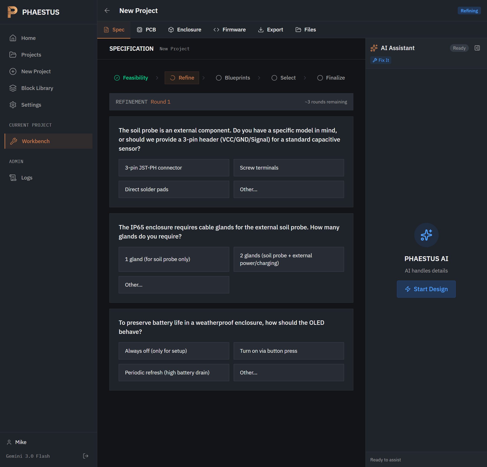
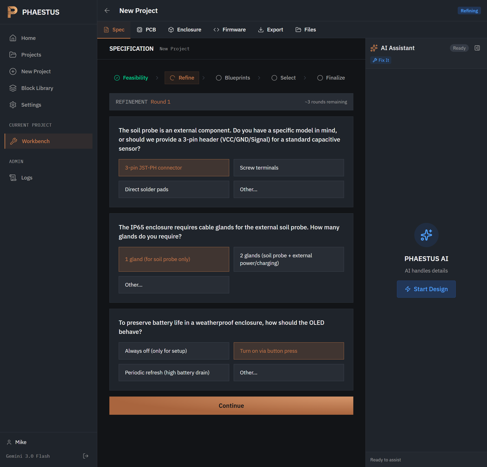
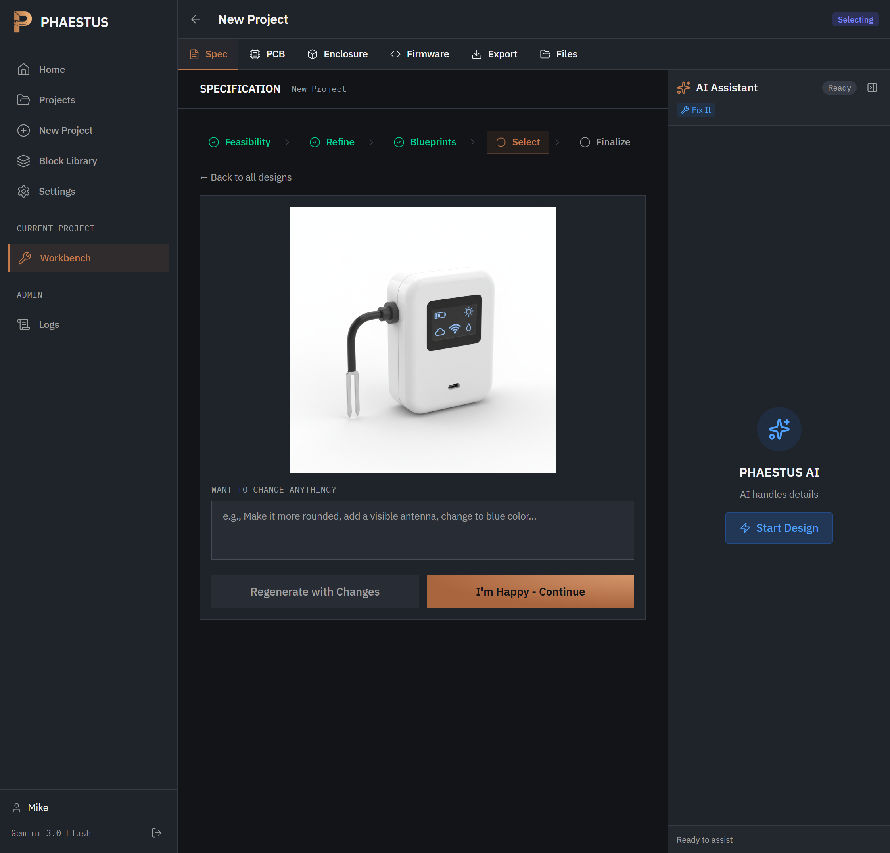
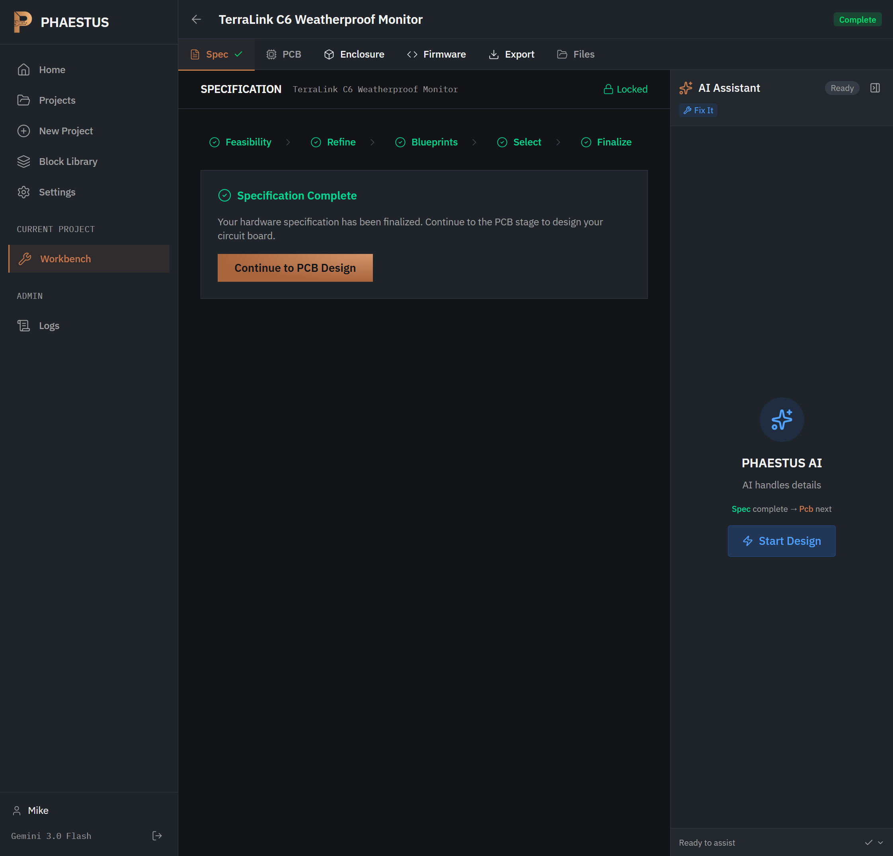
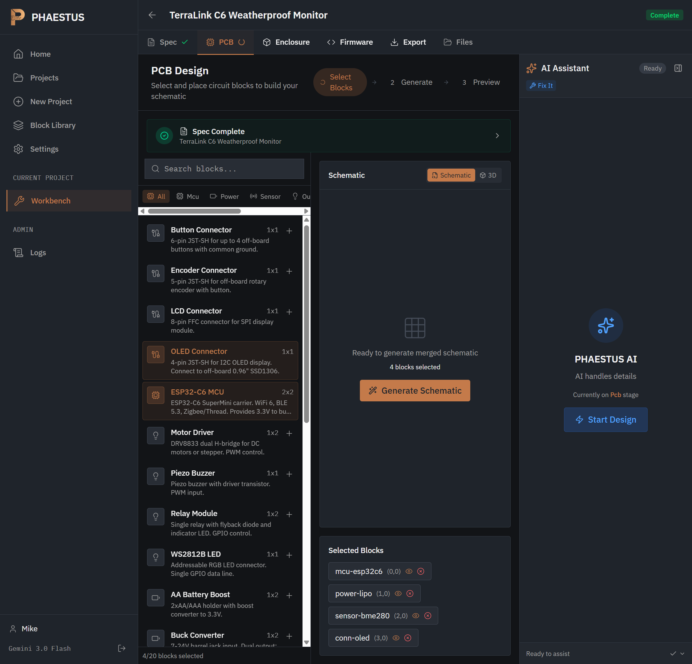
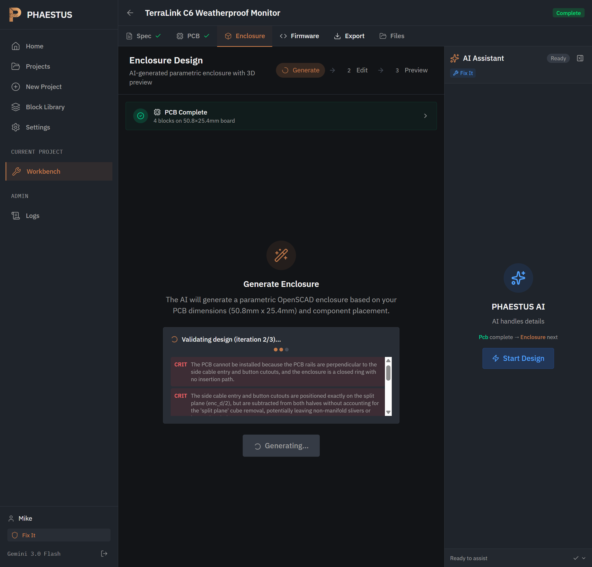
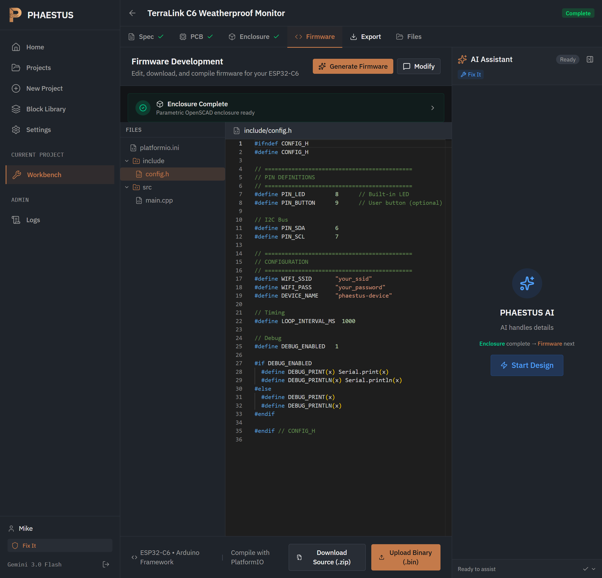
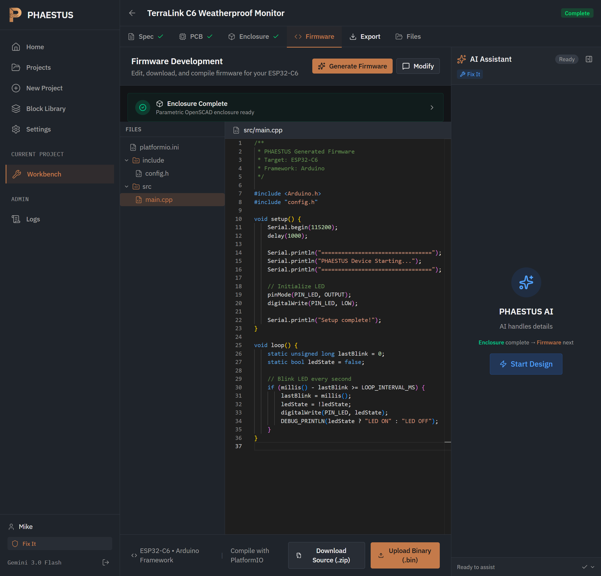

# 0029 - Product Walkthrough: From Idea to Manufacturing Files

**Date**: 2025-01-07
**Phase**: Documentation

## Overview

This walkthrough demonstrates the complete PHAESTUS product development flow, from an initial idea to downloadable manufacturing files. We'll create a soil moisture monitor as an example, showing every step of the journey.

## The Landing Page

First-time visitors see a clean landing page explaining what PHAESTUS does: transform natural language descriptions into complete hardware designs.

The page highlights key features:
- **KiCad Schematics** - Professional circuit designs
- **PCB Layouts** - Gerber files for manufacturing
- **3D Enclosures** - OpenSCAD parametric designs
- **Firmware Scaffolding** - ESP32 starter code
- **Bill of Materials** - Complete component lists

## Authentication

Clicking "Sign In" opens a modal for credentials. The interface is minimal and focused.

After logging in, the dashboard shows the authenticated home view with navigation to all features.

## Creating a New Project

The "New Project" page asks users to describe their hardware in plain English. Example prompts help illustrate the level of detail expected.

For this walkthrough, we'll build a soil moisture monitor:

> "Battery-powered soil moisture monitor with ESP32-C6 WiFi, BME280 for temperature/humidity, capacitive soil probe input, MQTT alerts to Home Assistant, LiPo battery with USB-C charging (TP4056), 0.96" OLED status display, IP65 weatherproof enclosure"

## Phase 1: Feasibility Analysis

The AI analyzes the request across four dimensions: Communication, Processing, Power, and I/O. Our soil moisture monitor scores 92%.

The analysis confirms:
- WiFi 6 via ESP32-C6 (100% for communication)
- Standard sensor processing needs (95%)
- LiPo + TP4056 power system (95%)
- BME280 sensor and OLED display supported

## Phase 2: Refinement Questions

The AI asks targeted questions to lock down design decisions. These address edge cases that affect the final design.

Questions cover:
1. **Soil probe connector type** - 3-pin JST-PH, screw terminals, or solder pads?
2. **Cable gland configuration** - How many penetrations for the IP65 enclosure?
3. **OLED power behavior** - Always off, button-activated, or periodic refresh?

Users select their preferences:

## Phase 3: Blueprint Generation

Four AI-generated product renders are created in parallel, showing different design interpretations.

The system generates 8 variations total - 4 "3D Render" style and 4 "Product Photography" style:

Users can click any design to see a larger view and provide feedback for regeneration:

## Phase 4: Specification Complete

After selecting a design, the AI generates a complete specification document with a creative project name.

Our project is named "TerraLink C6 Weatherproof Monitor" - the AI avoids generic prefixes like "Smart" or "IoT".

## Phase 5: PCB Design

The PCB stage shows a library of 21 pre-validated circuit blocks. Users select the components needed for their design.

For the soil moisture monitor, we select:
- ESP32-C6 MCU (2x2 grid)
- LiPo Battery with TP4056 charger (1x2 grid)
- BME280 Environment Sensor (1x1 grid)
- OLED Connector (1x1 grid)

Clicking "Generate Schematic" merges the selected blocks into a unified KiCad schematic:

The board dimensions (50.8 × 25.4 mm) are calculated automatically based on block sizes.

## Phase 6: Enclosure Design

The enclosure page generates parametric OpenSCAD code based on the PCB dimensions.

The AI generates code and identifies potential issues:

The OpenSCAD code is displayed in an editor, ready for customization:

Parameters include:
- Wall thickness
- Corner radius
- OLED aperture dimensions
- USB-C opening
- Cable gland holes
- Screw boss positions

Clicking "Render" generates a 3D preview using OpenSCAD WASM:

The preview is interactive - users can rotate, zoom, and pan.

## Phase 7: Firmware Development

The firmware page shows a PlatformIO project structure for the ESP32-C6:

The file tree includes:
- `platformio.ini` - Build configuration
- `include/config.h` - Pin definitions and settings
- `src/main.cpp` - Application code

The main source file contains startup code and a basic LED blink loop:

Users can:
- Edit code directly in the browser
- Download the source as a ZIP
- Modify via AI chat

## Phase 8: Export & Manufacturing

The final stage provides all downloadable files:

Available downloads:
- **spec.md** - Complete specification with requirements and BOM
- **bom.csv** - Component list for sourcing
- **enclosure.zip** - OpenSCAD source files
- **conversations.zip** - AI chat history by stage
- **complete.zip** - Everything in one package

Links to PCB manufacturers (JLCPCB, PCBWay) are provided for convenience.

## Summary

The complete flow takes a user from a plain-English description to:

| Output | Format | Purpose |
|--------|--------|---------|
| Specification | Markdown | Requirements documentation |
| Schematic | KiCad | Circuit design |
| PCB | Gerber (coming soon) | Board manufacturing |
| Enclosure | OpenSCAD/STL | 3D printing |
| Firmware | PlatformIO C++ | Microcontroller code |
| BOM | CSV | Component sourcing |

Each stage builds on the previous one, with AI assistance available throughout for questions and modifications.

## Technical Notes

- **Image Generation**: Blueprints use Gemini's image generation API
- **3D Rendering**: OpenSCAD runs entirely in the browser via WebAssembly
- **PCB Merging**: KiCad schematics are merged using the kicadts library
- **Block-Based Design**: Pre-validated 12.7mm grid modules ensure reliable assembly

---

*Screenshots captured via Playwright automation on 2025-01-07*
