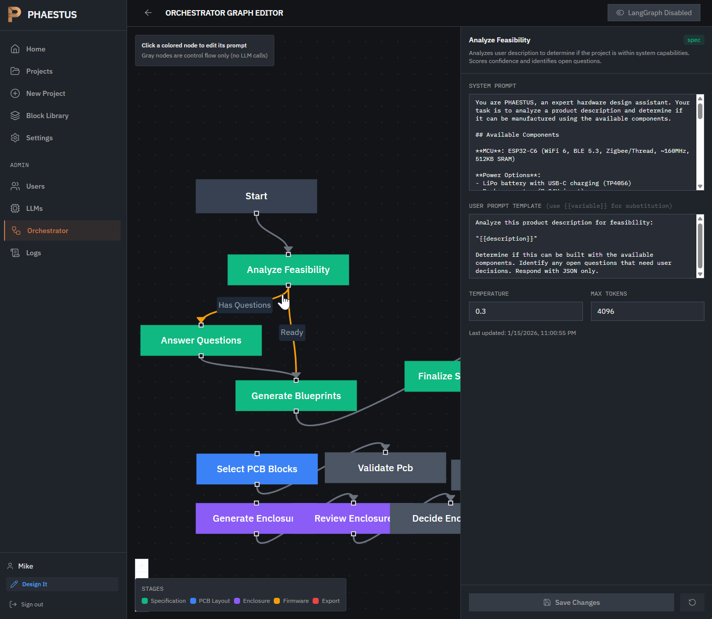

# Blog 32: Build vs Buy - Why We Deleted Our Custom Graph Editor

**Date**: January 16, 2026

## The Temptation to Build

When we started building PHAESTUS's AI orchestrator - a multi-agent system that guides users through hardware design - we needed to debug and visualize our LangGraph state machine.

The obvious answer: build a custom admin page.

So we did. `AdminOrchestratorPage.tsx` grew to 619 lines:
- ReactFlow integration for graph visualization
- Custom node/edge layout algorithms
- Stage-based color coding (spec, PCB, enclosure, firmware, export)
- Click-to-edit prompt functionality



It looked professional. Nodes colored by stage, edges showing the flow, a panel to edit prompts. We were proud of it.

## What We Actually Needed

But when we started using it for real debugging, the gap became obvious. Our visualization showed us *what* the graph looked like - not *how* it was executing.

For debugging an agent orchestrator, we needed:
1. **Step-by-step execution tracking** - Which node is running right now?
2. **State inspection** - What's in the state object at each step?
3. **Time-travel debugging** - Go back to a previous state and retry
4. **Breakpoints** - Pause execution before a specific node
5. **State editing** - Modify state mid-execution to test edge cases
6. **Hot reload** - Change code, see immediate effects

Our custom visualization provided exactly zero of these features.

## The Comparison

| Feature | Our Implementation | LangGraph Studio |
|---------|-------------------|------------------|
| Graph visualization | Static layout | Live updating |
| State inspection | None | Full state tree |
| Time-travel | None | Step back/forward |
| Breakpoints | None | Interrupt any node |
| State editing | None | Modify mid-run |
| Hot reload | None | Automatic |
| Prompt editing | Yes (D1 integration) | No |

We were comparing a screenshot to Chrome DevTools.

## The Setup (30 Minutes)

Getting LangGraph Studio working was straightforward:

```bash
# Install CLI
pnpm add -D @langchain/langgraph-cli
```

Create `langgraph.json`:

```json
{
  "node_version": "20",
  "graphs": {
    "orchestrator": "./src/services/orchestrator-graph/studio-export.ts:orchestrator",
    "orchestrator_automatic": "./src/services/orchestrator-graph/studio-export.ts:orchestratorAutomatic",
    "orchestrator_debug": "./src/services/orchestrator-graph/studio-export.ts:orchestratorDebug"
  },
  "env": ".dev.vars"
}
```

Create the export file:

```typescript
import { MemorySaver } from '@langchain/langgraph-checkpoint'
import { createOrchestratorGraph, INTERRUPT_NODES } from './graph'

const graph = createOrchestratorGraph()

// Standard mode with all interrupt points
export const orchestrator = graph.compile({
  checkpointer: new MemorySaver(),
  interruptBefore: [...INTERRUPT_NODES.all],
})

// Fully autonomous - no interrupts
export const orchestratorAutomatic = graph.compile({
  checkpointer: new MemorySaver(),
})

// Debug mode - interrupt at key decision points
export const orchestratorDebug = graph.compile({
  checkpointer: new MemorySaver(),
  interruptBefore: [...INTERRUPT_NODES.userDecisions, ...INTERRUPT_NODES.agentEscalation],
})
```

Run it:

```bash
npx @langchain/langgraph-cli dev
```

Studio opens at `https://smith.langchain.com/studio?baseUrl=http://localhost:2024`.

## The One Gotcha

Our LLM calls went through a Cloudflare Worker proxy (`/api/llm/*`). That doesn't exist in Studio's local environment.

The fix was adding a `LLM_MODE` environment variable:

```typescript
function isDirectMode(): boolean {
  if (typeof process !== 'undefined' && process.env?.LLM_MODE === 'direct') {
    return true
  }
  return false
}

async chat(options: ChatOptions): Promise<ChatResponse> {
  if (isDirectMode()) {
    return this.chatDirect(options)  // Direct OpenRouter API call
  }
  return this.chatProxy(options)     // Through Cloudflare Worker
}
```

Set `LLM_MODE=direct` in `.dev.vars`, and Studio's graph can make real LLM calls.

## The Decision

We kept both approaches, but separated concerns:

**Custom Admin Page (now 449 lines)**:
- Prompt editing (needs D1 integration)
- Feature flag toggle
- Link to Studio

**LangGraph Studio**:
- Graph debugging
- State inspection
- Time-travel
- Breakpoints

We deleted:
- ReactFlow visualization (~170 lines)
- Custom layout algorithms (~80 lines)
- Node/edge state management (~50 lines)

**Net result**: 170 fewer lines to maintain, infinitely better debugging.

## When to Build Your Own

There are legitimate reasons for custom tooling:

1. **Deep platform integration** - Our prompt editor needs D1 database access
2. **Custom UI requirements** - If your product needs a specific look
3. **Offline/edge requirements** - Studio needs internet
4. **Features the tool doesn't support** - Rare for mature tools

## When to Use the Mature Tool

1. **Development/debugging workflows** - You're the only user
2. **Standard patterns** - Your use case isn't special
3. **Time pressure** - Ship features, not tooling
4. **Rapid iteration** - You'll change the underlying system frequently

## The Uncomfortable Truth

The hardest part wasn't deleting the code. It was admitting that the afternoon we spent building a "proper" admin page could have been spent actually debugging our orchestrator.

We almost kept the visualization because we'd built it. Sunk cost fallacy is real.

## The Commit

```
Add LangGraph Studio integration and simplify admin page

LangGraph Studio Setup:
- Add @langchain/langgraph-cli for local development server
- Create studio-export.ts with 3 graph variants
- Add direct API mode to LLM service (LLM_MODE=direct)

Admin Page Simplification:
- Remove ReactFlow graph visualization (619 -> 449 lines)
- Convert to simple prompt list + editor layout
- Add link to LangGraph Studio for debugging
```

Next time someone suggests building custom dev tooling, the first question should be: "What existing tool does this better?"

Often, the answer is: "One that already exists."
