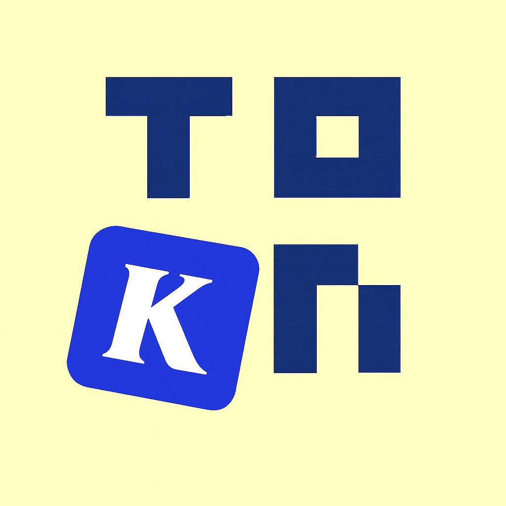
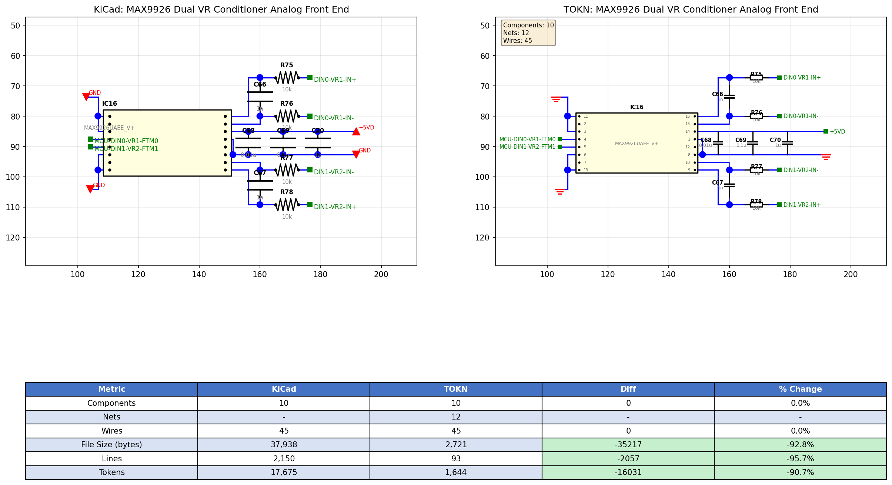

# Blog 35: Integrating TOKN - A KiCad Parser That Actually Works

**Date**: January 17, 2026



## The `hide` Token Problem

Blog 34 shipped with a bug. A nasty one.

Users uploading KiCad 8 schematics got: `"model encountered unsupported child token 'hide'"`. The kicadts library we were using hadn't been updated for KiCad 8's new S-expression syntax.

```
(property "Reference" "U1"
  (at 0 0 0)
  (effects (font (size 1.27 1.27)) hide)  // <- kicadts: "what is hide?"
)
```

KiCad 8 added `hide` as a shorthand for hidden properties. Old parsers choke on it.

## Enter TOKN



[TOKN](https://github.com/MichaelAyles/tokn) (Token-Optimised KiCad Notation) is a format designed specifically for feeding KiCad schematics to LLMs. The parser handles all KiCad versions, and the output format compresses schematics by ~92% compared to raw S-expressions.

The comparison above shows what 92% token reduction looks like. The original KiCad schematic has deeply nested S-expressions with verbose keywords. TOKN strips it to the essential information: component references, values, footprints, pin definitions, net connections, and wire coordinates.

## Why We Needed This

Our block import flow:

1. Parse KiCad files
2. Extract components and nets
3. Send to LLM with context
4. Generate block.json

The kicadts library did step 1... until users had KiCad 8 files. Then it threw errors on syntax it didn't recognize.

TOKN's S-expression parser is robust. It handles:

- Quoted strings with escapes
- Nested parentheses to any depth
- Unknown tokens (ignores them gracefully)
- Both old and new KiCad syntax

## The TypeScript Port

TOKN was originally Python. We needed it in TypeScript for our Cloudflare Functions. The port lives in `src/lib/tokn/`:

```
src/lib/tokn/
├── sexpr.ts        # S-expression tokenizer and parser
├── kicadSch.ts     # Schematic parser (components, wires, labels)
├── connectivity.ts # Net list builder (union-find algorithm)
├── toknEncoder.ts  # TOKN format encoder
└── index.ts        # Barrel exports
```

### The S-Expression Parser

The foundation. KiCad files are S-expressions - parenthesized lists like LISP:

```
(kicad_sch
  (symbol (lib_id "Device:R")
    (property "Reference" "R1")
    (property "Value" "10k")))
```

Our parser tokenizes this into a tree:

```typescript
export function parse(text: string): SExpr {
  const tokens = tokenize(text)
  let pos = 0

  function parseExpr(): SExpr {
    if (tokens[pos] === '(') {
      pos++ // consume (
      const list: SExpr[] = []
      while (tokens[pos] !== ')') {
        list.push(parseExpr())
      }
      pos++ // consume )
      return list
    }
    return tokens[pos++] // atom
  }

  return parseExpr()
}
```

Helper functions make traversal easy:

```typescript
// Get first child with name
get(expr, 'property') // -> ['property', 'Reference', 'R1']

// Get all children with name
getAll(expr, 'symbol') // -> [['symbol', ...], ['symbol', ...]]

// Get value of named child
getValue(expr, 'title') // -> "My Schematic"
```

### The Schematic Parser

Walks the S-expression tree and extracts structured data:

```typescript
export interface Component {
  libId: string // "Device:R"
  reference: string // "R1"
  value: string // "10k"
  footprint: string // "Resistor_SMD:R_0402"
  x: number
  y: number
  angle: number
  pins: Map<string, Point> // Pin positions
}

export interface Schematic {
  title: string
  libSymbols: Map<string, LibSymbol>
  components: Component[]
  wires: Wire[]
  junctions: Junction[]
  labels: Label[]
}
```

Pin positions are computed by transforming library symbol pin coordinates through the component's position, rotation, and mirror state:

```typescript
function transformPin(pinX, pinY, compX, compY, angle, mirror): Point {
  let px = pinX,
    py = -pinY // KiCad's Y is inverted

  if (mirror === 'x') py = -py
  else if (mirror === 'y') px = -px

  const rad = (-angle * Math.PI) / 180
  const rx = px * Math.cos(rad) - py * Math.sin(rad)
  const ry = px * Math.sin(rad) + py * Math.cos(rad)

  return { x: compX + rx, y: compY + ry }
}
```

### The Connectivity Analyzer

This is where the magic happens. KiCad stores wires as line segments and labels as floating text. The analyzer figures out which pins are actually connected.

Algorithm:

1. Build a point-to-segment mapping (which wire endpoints share coordinates)
2. Use union-find to group connected wire segments
3. For each group, find all pins that touch any point in the group
4. Assign net names from labels or power symbols

```typescript
export function analyzeConnectivity(sch: Schematic): Netlist {
  // Union-find for wire connectivity
  const parent = Array.from({ length: sch.wires.length }, (_, i) => i)

  function find(x: number): number {
    if (parent[x] !== x) parent[x] = find(parent[x])
    return parent[x]
  }

  function union(x: number, y: number): void {
    parent[find(x)] = find(y)
  }

  // Connect wires that share endpoints
  for (let i = 0; i < sch.wires.length; i++) {
    for (let j = i + 1; j < sch.wires.length; j++) {
      if (wiresShareEndpoint(sch.wires[i], sch.wires[j])) {
        union(i, j)
      }
    }
  }

  // Group wires, find pins at wire endpoints, assign net names
  // ...
}
```

The result is a proper netlist:

```typescript
interface Net {
  name: string // "GND", "N1", "I2C_SDA"
  pins: [string, string, string][] // [ref, pin_number, pin_name]
  wires: WireSegment[]
  isPower: boolean
}
```

## Integration with kicad-parser.ts

Our existing `kicad-parser.ts` now imports from tokn:

```typescript
import { parseSchematic, analyzeConnectivity } from '../lib/tokn'
import { parse, get, getAll } from '../lib/tokn/sexpr'

export function parseKicadSchematic(content: string): Partial<KicadExtract> {
  const sch = parseSchematic(content)
  const netlist = analyzeConnectivity(sch)

  const components: ExtractedComponent[] = []
  for (const comp of netlist.components) {
    components.push({
      reference: comp.reference,
      value: comp.value,
      footprint: comp.footprint.split(':').pop() || comp.footprint,
      libraryId: comp.libId,
    })
  }

  return {
    components,
    nets: netlist.nets.map((n) => n.name),
    projectName: sch.title || undefined,
  }
}
```

The PCB parser uses the low-level S-expression functions directly:

```typescript
export function parseKicadPcbFile(content: string): Partial<KicadExtract> {
  const expr = parse(content)

  if (!Array.isArray(expr) || expr[0] !== 'kicad_pcb') {
    throw new Error('Not a valid KiCad PCB file')
  }

  const nets: string[] = []
  for (const net of getAll(expr, 'net')) {
    if (net.length >= 3 && typeof net[2] === 'string') {
      const netName = net[2]
      if (netName && !netName.startsWith('unconnected-')) {
        nets.push(netName)
      }
    }
  }

  return { nets, boardSize }
}
```

## What We Gained

1. **KiCad 8 support**: The `hide` token and other new syntax works fine
2. **No external dependencies**: tokn is 400 lines of TypeScript, zero npm packages
3. **Robust parsing**: Unknown tokens are ignored, not errors
4. **Connectivity analysis**: Real net lists instead of just wire endpoints
5. **Token efficiency**: If we ever need to send raw schematics to LLMs, TOKN format uses 92% fewer tokens

## The Lesson

Third-party KiCad parsing libraries:

- kicad-utils: Last updated 2020, KiCad 5 era
- kicadts: Last updated 2024, but still doesn't handle KiCad 8
- Various Python libraries: Don't help in a TypeScript/Cloudflare environment

Sometimes you need to own your parser. Especially for formats that evolve as actively as KiCad's.

The full TOKN spec and Python reference implementation are at [github.com/MichaelAyles/tokn](https://github.com/MichaelAyles/tokn). The TypeScript port is now part of PHAESTUS.

## The Commit

```
Replace kicadts with tokn for KiCad file parsing

- Add tokn TypeScript library for parsing KiCad S-expressions
- Remove kicadts dependency that didn't support KiCad 8 syntax
- Update kicad-parser.ts to use tokn's parseSchematic and analyzeConnectivity
- Supports the "hide" token and other KiCad 8 features
```

Block imports now work with any KiCad version. Time to load some real data.
