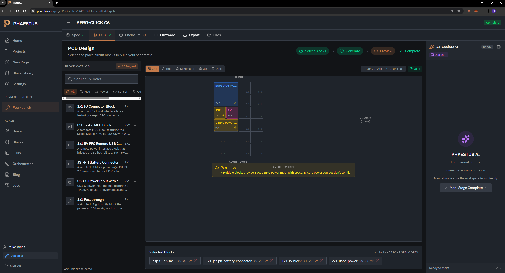
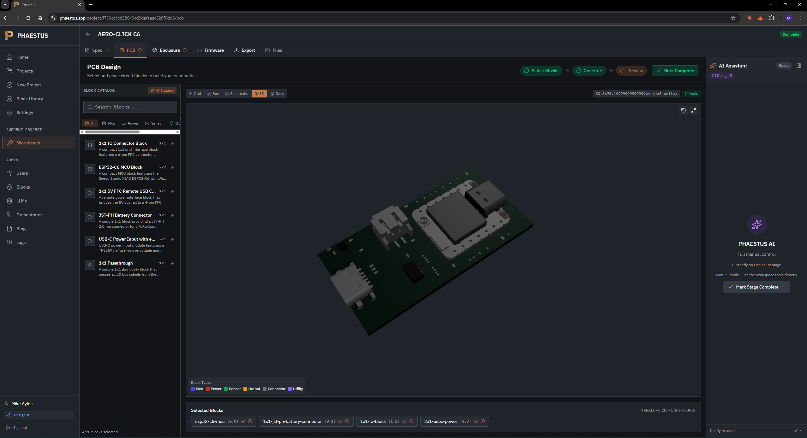
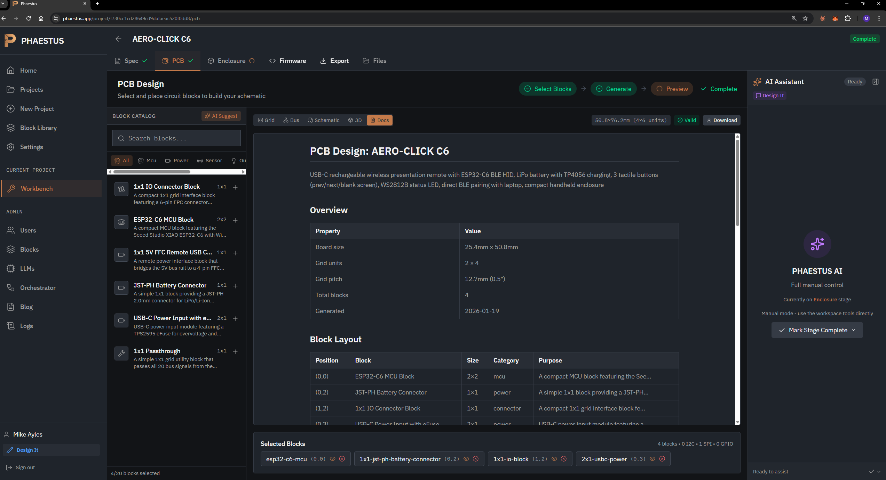

# Blog 39: The PCB Design Stage - From Block Selection to Manufacturing Files

**Date**: January 19, 2026

## The Challenge: Making PCB Design Accessible

Traditional PCB design requires:
- Learning KiCad or Altium (weeks of tutorials)
- Understanding schematic symbols and footprints
- Manual routing (hours per board)
- DRC rule configuration
- Gerber generation and review

PHAESTUS takes a different approach: **modular block composition**. Pre-validated circuit blocks snap together on a 12.7mm grid. No routing. No DRC failures. Just pick blocks, place them, generate.

## The PCB Design Workflow

### Step 1: Select Blocks

The block catalog shows available modules filtered by category:

- **MCU**: ESP32-C6 (2×2) - WiFi, BLE, Zigbee
- **Power**: USB-C with eFuse (2×1), JST-PH battery (1×1)
- **Connector**: IO block (1×1), FFC remote USB (1×1)
- **Utility**: Passthrough (1×1) for bus continuity

Each block has a size in grid units. A 2×2 block occupies four cells. Blocks connect via a 20-signal bus running north-to-south through each column.

### Step 2: Place on Grid



The grid editor provides:

**Visual Placement**
- Drag blocks from catalog to grid
- Ghost preview shows valid/invalid positions
- Click to select, rotate, or remove

**Real-Time Validation**
- Bus continuity checking (every column needs an unbroken path)
- Power budget warnings ("Multiple blocks provide 5V0")
- Edge-mount constraints (USB-C must be at board edge)

**Dimension Display**
- Grid size in mm and units
- NORTH/SOUTH orientation labels
- Per-block size indicators

### Step 3: Review in Multiple Views

Five tabs let you inspect the design from different angles:

**Grid** - The placement editor shown above

**Bus** - Signal flow visualization showing which blocks provide/consume each bus signal

**Schematic** - KiCanvas rendering of the merged schematic (coming soon)

**3D** - Real STEP model preview with per-component colors



**Docs** - Generated documentation ready for export



### Step 4: Generate Outputs

Clicking "Generate" produces:

1. **Merged KiCad Schematic** - All blocks combined with proper net labels
2. **PCB Layout** - Footprints positioned on the 12.7mm grid
3. **3D Assembly** - STEP file for mechanical integration
4. **Documentation** - Markdown with BOM, pinout, specifications

## The Block Composition Model

Why does this work without routing?

**Standardized Bus Interface**

Every block connects to the same 20-signal bus:
- Power rails: 5V0, 3V3, GND
- Communication: I2C (SDA, SCL), SPI (MOSI, MISO, SCK, CS)
- GPIO: 8 general-purpose pins
- Auxiliary: 5 expansion signals

**Pre-Routed Modules**

Each block is a complete, tested circuit:
- Internal routing done by humans in KiCad
- Edge castellations connect to bus signals
- No inter-block routing needed

**Grid Alignment**

The 12.7mm (0.5") grid ensures:
- Predictable board dimensions
- Consistent mounting hole positions
- Compatible enclosure generation

## Validation Rules

The grid editor enforces:

| Rule | What It Checks |
|------|----------------|
| Bus Continuity | Every column has blocks from north to south edge |
| Power Budget | Total consumption ≤ total supply per rail |
| Edge Mount | USB-C, antennas placed at board edges |
| No Overlap | Blocks don't occupy same cells |
| I2C Addresses | No conflicts on shared bus |

Warnings appear inline. Errors block generation.

## Generated Documentation

The Docs tab produces markdown like:

```markdown
## PCB Design: AERO-CLICK C6

USB-C rechargeable wireless presentation remote with ESP32-C6...

### Overview

| Property | Value |
|----------|-------|
| Board size | 25.4mm × 50.8mm |
| Grid units | 2 × 4 |
| Grid pitch | 12.7mm (0.5") |
| Total blocks | 4 |

### Block Layout

| Position | Block | Size | Category |
|----------|-------|------|----------|
| (0,0) | ESP32-C6 MCU Block | 2×2 | mcu |
| (0,2) | JST-PH Battery Connector | 1×1 | power |
| (1,2) | 1x1 IO Connector Block | 1×1 | connector |
| (0,3) | USB-C Power Input | 2×1 | power |
```

One click downloads everything as a ZIP.

## What's Next

The PCB stage now handles:
- ✅ Block selection and placement
- ✅ Grid validation with warnings/errors
- ✅ 3D preview with real STEP models
- ✅ Documentation generation

Still coming:
- Schematic merging (KiCad file generation)
- PCB layout export
- Gerber generation
- Direct JLCPCB/PCBWay ordering

The goal: go from product idea to order-ready files without opening KiCad once.
