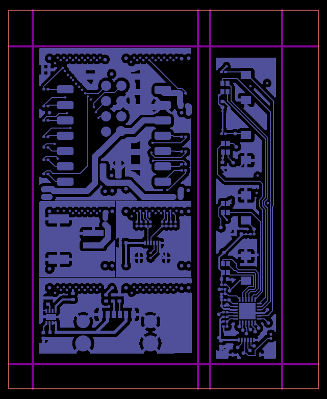

# Blog 42: Panelization - Why Multiple Boards Share One Manufacturing Run

**Date: January 21, 2026**

Blog 40 covered merging Gerber files into a single main board. But PHAESTUS designs often include remote boards - button panels, display breakouts, USB connectors that sit away from the main PCB. These need to be manufactured together. That means panelization.

## The Manufacturing Reality

PCB fabrication has fixed costs per panel, not per board. A 100x100mm panel costs roughly the same to fabricate whether it contains one board or ten. Assembly machines also work per panel - placing components, reflowing solder, running tests.

If you order a 25x50mm main board and a 10x50mm remote board separately, you pay twice. Panel them together and you pay once.

## V-Scoring: The Simple Case

V-score separation is the standard approach. The fab house runs a rotary blade partially through the panel, creating a V-shaped groove on both sides. After assembly, you snap the boards apart.

```
Panel cross-section:
     |         |         |
   Board A   V-score   Board B
     |         |         |
```

V-scores work when:
- The cut line spans the full panel dimension
- All boards along that line have aligned edges
- The cut is straight (no turns)

For two boards of identical height, horizontal V-scores at top and bottom, vertical V-scores between boards. Simple.

## Mixed Heights: The Problem

Our test layout has a main board at 50.8mm tall and a remote board at 50mm tall - a 0.8mm difference. Both boards align at their bottom edge (where the panel rail is), but their tops are at different heights.

```
       Main       Remote
    +--------+   +------+
    |        |   |      | <- Remote top (50mm)
    |        |   +------+
    |        |            <- Main top (50.8mm)
    +--------+
```

A V-score at the main board's top (50.8mm) would slice through the remote board 0.8mm from its edge. A V-score at the remote board's top (50mm) would leave the main board's top 0.8mm attached to the panel.

Neither works. V-scores must span the full panel width.

## Routing: The Expensive Fix

When edges don't align, you route instead of V-score. A 2mm end mill cuts a slot that separates the board from the panel.

```
       Main       Remote
    +--------+   +======+  <- Routed top edge
    |        |   |      |
    |        |   |      |
    +--------+---+------+  <- V-scored bottom (continuous)
```

Routing is slower and more expensive than V-scoring, but it handles arbitrary shapes. We use it only where we must - the top edges of shorter boards.

## The Clearance Math

V-scores and routes can't run right at the board edge. Copper traces need clearance from the cut line, or they'll be damaged during separation.

Our layout uses 1mm clearance on each side:

```
Board copper | 1mm gap | V-score | 1mm gap | Board copper
```

Routes have an additional complexity - the mill bit has diameter. Our 2mm bit means the route line represents the bit's center. When the route runs at the board's v-score position, the bit extends 1mm past on each side.

```
         |<--1mm-->|<--2mm bit-->|<--1mm-->|
Board A  | margin  |  route cut  | margin  | Board B
```

This means boards can't share the same v-score line when routing is involved. We need 4mm minimum spacing between boards:
- 1mm from Board A edge to A's v-score
- 2mm for the route bit diameter
- 1mm from B's v-score to Board B edge

## Implementation

The panel merge service does this automatically:

1. **Calculate layout**: Position boards with proper spacing (4mm between boards, 5mm from panel edges)

2. **Determine max height**: Find the tallest board - its top edge sets the panel content height

3. **Generate v-scores**:
   - Vertical lines at each board's left and right edges (±1mm offset)
   - Horizontal line at bottom (all boards share this)
   - Horizontal line at top (only if board height matches max)

4. **Generate routes**: For any board shorter than max, route its top edge instead of v-scoring

5. **Merge Gerbers**: Offset each board's gerber content to its panel position, merge all layers

The output includes three separation-related files:
- **Edge cuts**: Panel outline
- **V-score layer**: Lines for the V-score machine
- **Routed edges layer**: Paths for the routing mill

## The Panel Preview



The preview shows:
- Main board (left): Full v-score on all four edges
- Remote board (right): V-scored bottom and sides, routed top
- Proper spacing between boards for route bit clearance
- 1mm margin from all board edges to separation lines

## Why This Matters

Without panelization:
- Multiple fab orders (main board, each remote board separately)
- Multiple assembly runs
- Manual alignment during programming/testing
- Higher total cost

With panelization:
- Single fab order
- Single assembly run
- Boards stay physically connected until final assembly
- Shared fiducials and test points possible

The complexity of handling mixed-height boards and hybrid v-score/routing pays off in manufacturing simplicity. Every PHAESTUS design with remote boards can be fabricated and assembled as a single panel, then separated at the end.

## What's Next

The panel merge is working for gerbers. Next up: generating the complete manufacturing package - drill files, pick-and-place coordinates transformed to panel positions, and the manufacturing spec document that tells the fab house exactly how to process the panel.
