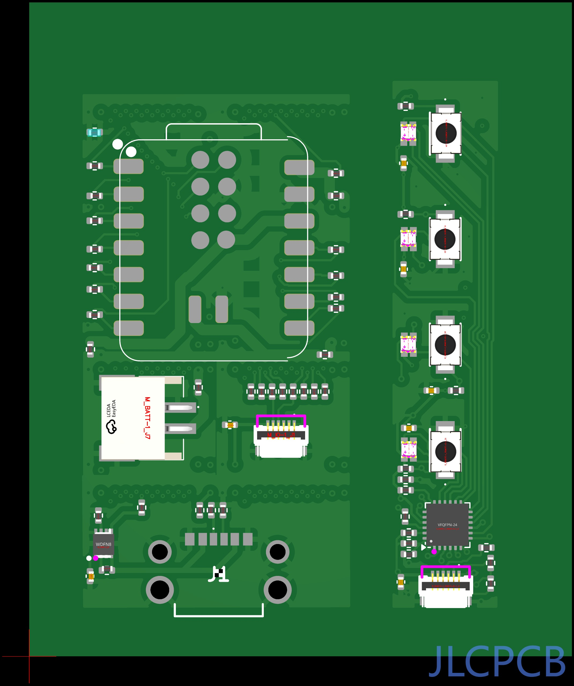

# Blog 43: We Ordered Our First Board!

**Date: January 22, 2026**

After weeks of wrestling with Gerber files, debugging coordinate systems, and learning more about PCB manufacturing than I ever expected, we finally did it. The order is in. Real boards are being fabricated in Shenzhen right now.

Look at that beautiful "Paid" status. Five prototype boards and five assembled PCBAs, currently being reviewed before production begins.

## The Road Here Was... Something

If you've been following this blog, you know the journey hasn't been smooth. What started as "just merge some KiCad files together" turned into a months-long odyssey through:

**The Great Coordinate Fiasco** - Components appearing in the wrong places because we were calculating offsets from copper layers instead of board edges. Watching a QFN-24 chip float 15mm away from its intended home in the JLCPCB preview was a special kind of horror.

**The BOM That Wouldn't Match** - Different blocks using slightly different component values. Is it "100n" or "100nF"? Is the footprint "R_0402_1005Metric" or "0402"? JLCPCB's system is picky, and rightly so - you don't want ambiguity when a robot is placing thousands of parts per hour.

**The 0201 Incident** - Realising that JLCPCB charge extra for 0201 (0.6mm x 0.3mm - smaller than a grain of sand) and me being tight, having to redesign all the blocks to use only 0402 or greater.. Swapping every passive in five different KiCad projects and re-laying out the boards was not how I planned to spend that evening.

**Panelization Pain** - Our remote IO board is taller than the main board. You can't v-score a line that only goes partway across a panel. So now we v-score the tall boards and route the tall ones. The panel merge code has more edge cases than I'd like to admit, however it should dynamically adjust, if we used a 2 channel IO board, it should route the top edge of the IO board and v-score the main.

**The Designator Nightmare** - When you merge multiple blocks onto one panel, suddenly you have three different "R1" resistors. The solution? Prefix everything: M_ESP32-1_R1, M_BATT-1_R1, R_REMOTE-1_R1. Our centroid file looks like alphabet soup, but at least every component has a unique name.

## What We're Actually Building

The panel contains two boards that will snap apart after assembly:

**Main Board** (left side) - An ESP32-C6 development platform with:

- XIAO ESP32-C6 module (WiFi 6, BLE 5.3, Zigbee/Thread)
- USB-C power input with protection
- LiPo battery connector
- 6-pin FFC connector for the remote board

**Remote IO Board** (right side) - A 4-channel input/output panel:

- AW9523B I2C GPIO expander
- 4 tactile buttons
- 4 RGB LEDs
- Connected via FFC cable

The whole thing is built from our modular block library - snap together pre-validated circuits like LEGO, merge the Gerbers, generate the BOM, and ship it.

## The Panel in All Its Glory

There it is. 51.4 x 62mm of hopes and dreams. The main board on the left, the remote IO strip on the right, held together until someone snaps them apart along the v-score lines.

You can see the ESP32 module footprint dominating the main board, the USB-C connector at the bottom, and the JST battery connector on the side. The remote board has its four buttons marching down the edge, each with an adjacent LED, and the QFN-24 AW9523B hiding in the corner doing all the I/O expansion work.

## The Damage

I won't lie - this isn't cheap. PCB fabrication is reasonable, but assembly costs add up fast:

- Setup fees for SMT assembly
- Per-component placement charges (66 components across the panel)
- Extended component fees for parts not in JLCPCB's basic library
- The "economic PCBA" option that's still not exactly economical

For a prototype run of 5 boards, you're paying a premium. The per-unit cost will drop dramatically at scale, but right now we're firmly in "learning tax" territory.

Still worth it. Absolutely worth it.

## What Happens Next

The boards should arrive in about two weeks. Then comes the moment of truth:

- Do the components actually fit their footprints?
- Did we get all the rotations right?
- Does the FFC cable actually connect the two boards?
- Will it power on without releasing magic smoke?

If everything works, we'll have validated the entire PHAESTUS pipeline - from AI-assisted design through block selection, Gerber merging, BOM generation, and real-world manufacturing.

If something's wrong... well, that's what a future blog will be about.

## A Moment of Pride

42 blog posts to get here. Countless late nights debugging coordinate transforms, fighting with KiCad parsers, and learning the arcane details of Gerber format specifications. We built a system that takes modular circuit blocks and turns them into real, manufacturable hardware.

And now boards are actually being made.

Sometimes you just have to stop and appreciate the milestone before diving into the next problem. Today is that day.

The boards are ordered. The rest is waiting.

---

_Next up: Either a triumphant "it works!" post, or a detailed post-mortem. Hardware has a way of keeping you humble._
