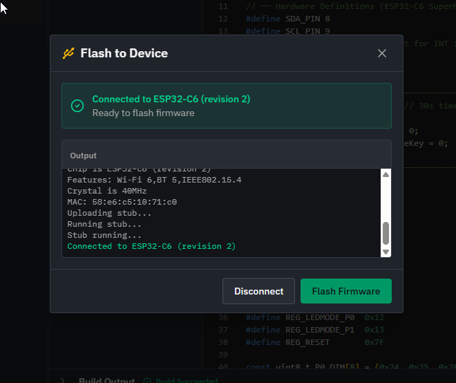
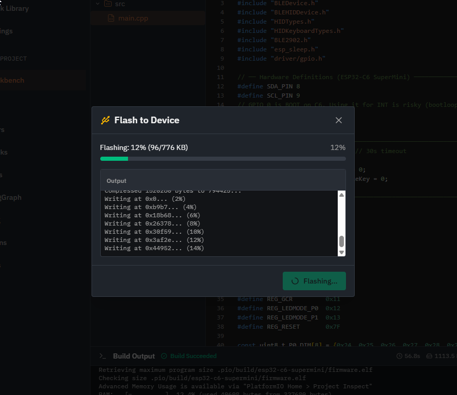
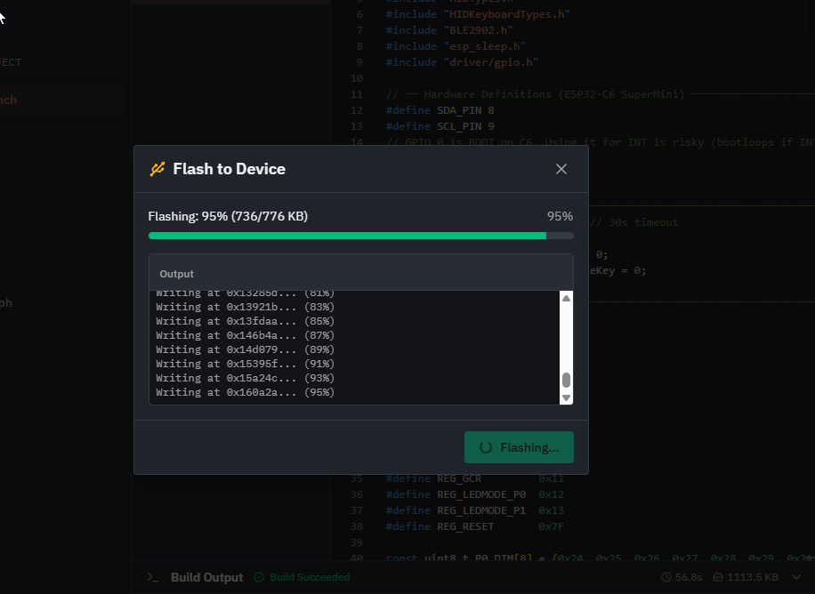

# Blog 45: Browser-Based Firmware Flashing with WebSerial

**Date: January 26, 2026**

Until now, PHAESTUS could generate firmware, compile it in the cloud, and let you download the binary. But then you'd need to install esptool, open a terminal, figure out the right COM port, and run a command that looks like gibberish to anyone who isn't a firmware developer. We wanted something better.

## The WebSerial API

Modern browsers (Chrome and Edge 89+) support the WebSerial API, which lets web pages communicate directly with serial devices. This is the same API that powers browser-based tools like the Arduino Web Editor and Adafruit's WebSerial ESPTool.

Espressif, the company behind the ESP32, maintains an official JavaScript implementation called `esptool-js`. It's the same flashing logic as the Python esptool, but running entirely in the browser.

## Integration Architecture

The implementation has three layers:

**1. WebSerial Service (`src/services/webserial-flash.ts`)**

This wraps esptool-js with a clean interface:

```typescript
export class WebSerialFlashService {
  async connect(): Promise<{ success: boolean; chip?: string; error?: string }>
  async flash(firmware: Uint8Array): Promise<{ success: boolean; error?: string }>
  async disconnect(): Promise<void>
}
```

When you call `connect()`, the browser prompts you to select a serial port. We filter for known ESP32 USB vendor IDs:

```typescript
const ESP32_USB_FILTERS: SerialPortFilter[] = [
  { usbVendorId: 0x10c4 }, // Silicon Labs CP210x
  { usbVendorId: 0x1a86 }, // CH340/CH341
  { usbVendorId: 0x303a }, // Espressif native USB
  { usbVendorId: 0x0403 }, // FTDI
]
```

This means the port picker only shows relevant devices, not every serial port on your system.

**2. Flash Modal (`src/components/firmware/FlashModal.tsx`)**

A step-by-step UI that guides users through the process:

1. Instructions for putting the board in bootloader mode
2. "Connect" button that triggers the browser's port picker
3. Progress bar during flashing
4. Terminal output showing esptool's messages
5. Success/error states

The terminal output is particularly useful for debugging. If something goes wrong, users can see exactly what esptool reported.



**3. BuildPanel Integration**

After a successful compile, a "Flash to Device" button appears next to "Download firmware.bin". This only shows up if the browser supports WebSerial—Firefox and Safari users see the download button but not the flash button.

## The Bootloader Dance

ESP32 boards have a quirk: to enter bootloader mode, you typically need to hold the BOOT button while pressing the EN (reset) button. Some newer DevKits with native USB handle this automatically through USB CDC signals, but many boards still require the manual button dance.

The modal includes instructions for this, and esptool-js handles the actual protocol:

```typescript
// esptool-js detects the chip and loads the appropriate stub
const chip = await this.esploader.main()
// Returns something like "ESP32-C6"
```

Once connected, esptool uploads a small "stub" program to RAM that handles the actual flash writing. This stub is much faster than the ROM bootloader.

## Data Flow

The firmware comes from our cloud compilation service as base64. For flashing, we need to:

1. Decode base64 to Uint8Array (for size display)
2. Re-encode to base64 for esptool-js (it expects string data internally)

```typescript
// In FlashModal - decode for the service
const binaryStr = atob(firmwareBase64)
const firmware = new Uint8Array(binaryStr.length)
for (let i = 0; i < binaryStr.length; i++) {
  firmware[i] = binaryStr.charCodeAt(i)
}

// In the service - re-encode for esptool-js
const firmwareBase64 = uint8ArrayToBase64(firmware)
const fileArray = [{ data: firmwareBase64, address: 0x0 }]
```

This feels redundant, but esptool-js's TypeScript types expect string data, and we want to show the correct byte count in the UI.

## Progress Reporting

esptool-js provides a progress callback:

```typescript
reportProgress: (fileIndex: number, written: number, total: number) => {
  const percent = Math.round((written / total) * 100)
  this.emitProgress({
    stage: 'flashing',
    progress: percent,
    message: `Flashing: ${percent}%`,
  })
}
```





We pipe this to the modal's progress bar. The terminal also shows esptool's verbose output through a terminal interface:

```typescript
const terminal = {
  clean: () => {},
  writeLine: (data: string) => this.emitTerminal('info', data),
  write: (data: string) => {
    if (data.trim()) this.emitTerminal('info', data.trim())
  },
}
```

## Browser Compatibility

WebSerial is Chromium-only. Firefox has explicitly declined to implement it, citing security concerns about giving websites access to serial ports. Safari hasn't implemented it either.

We detect support at runtime:

```typescript
export function isWebSerialSupported(): boolean {
  return typeof navigator !== 'undefined' && 'serial' in navigator
}
```

Unsupported browsers see a warning banner in the modal explaining that they need Chrome or Edge. The flash button itself is hidden, so users don't even see a broken feature—they just see the download option.

## What We Didn't Build

A few things we considered but skipped:

**Multiple file flashing**: ESP32 typically needs bootloader, partition table, and app binary at different addresses. Our cloud compiler outputs a single merged binary at address 0x0, so we only need to flash one file.

**Baud rate selection**: esptool-js defaults to 115200, which is reliable. Higher rates are faster but can cause issues with some USB-serial chips. We went with reliability over speed.

**Erase before flash**: esptool can erase the entire flash before writing. We don't do this—we just write the app partition. Full erase would wipe WiFi credentials and other NVS data.

## The Result

From the user's perspective: click Compile, wait for the build, click "Flash to Device", pick your board from the browser's port picker, hold BOOT and press EN if needed, and watch the progress bar fill up. No terminal commands, no driver hunting, no esptool installation.

It's the kind of feature that seems obvious in retrospect. If the browser can compile code (via our cloud service) and the browser can talk to serial ports (via WebSerial), why would you ever leave the browser to flash firmware?
