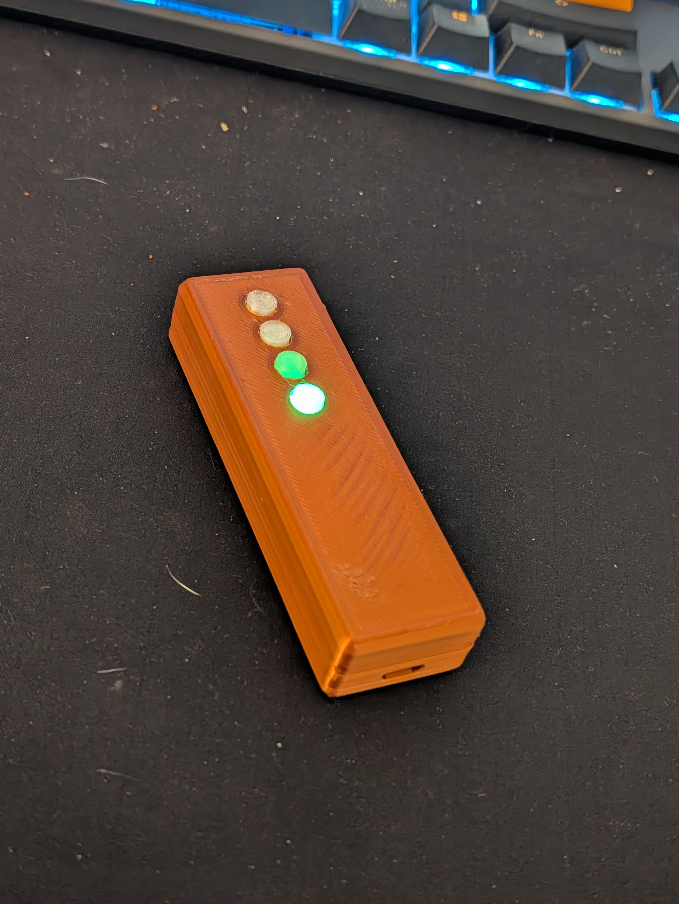
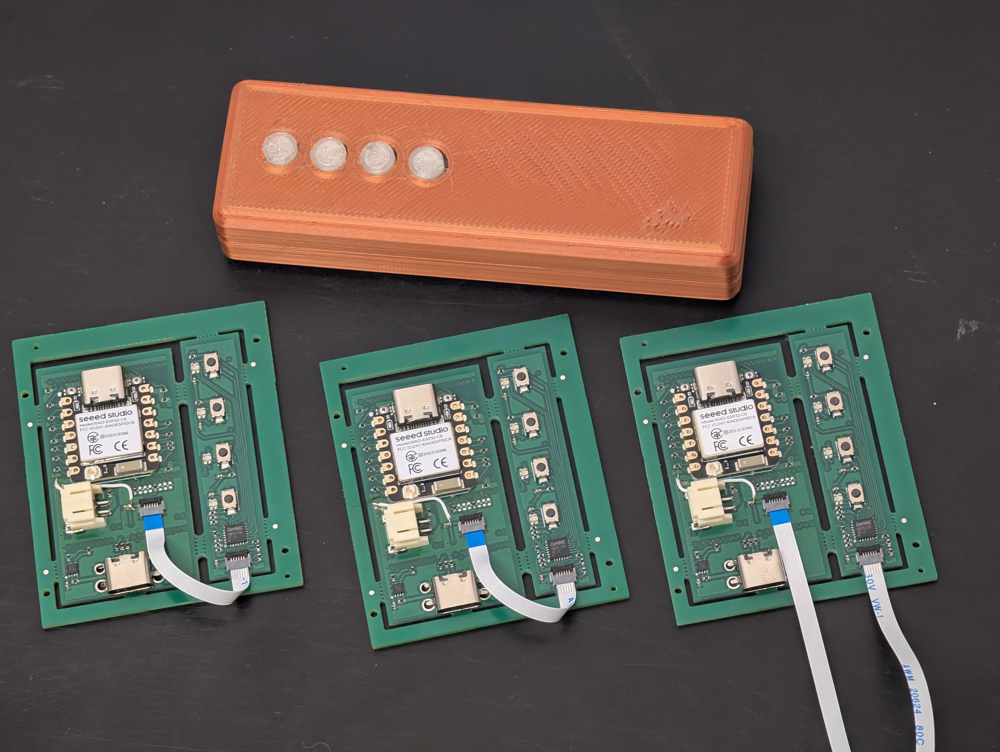
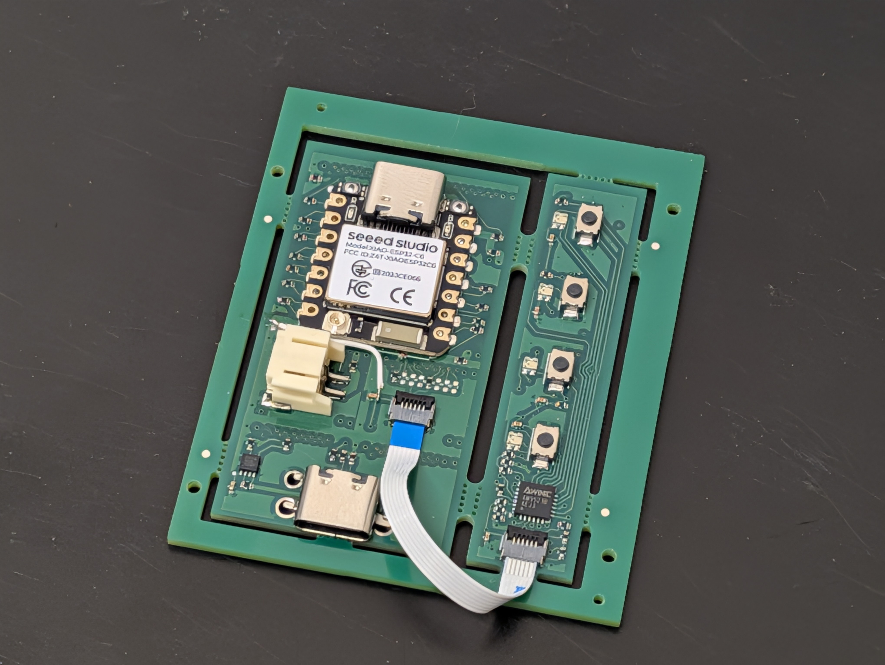
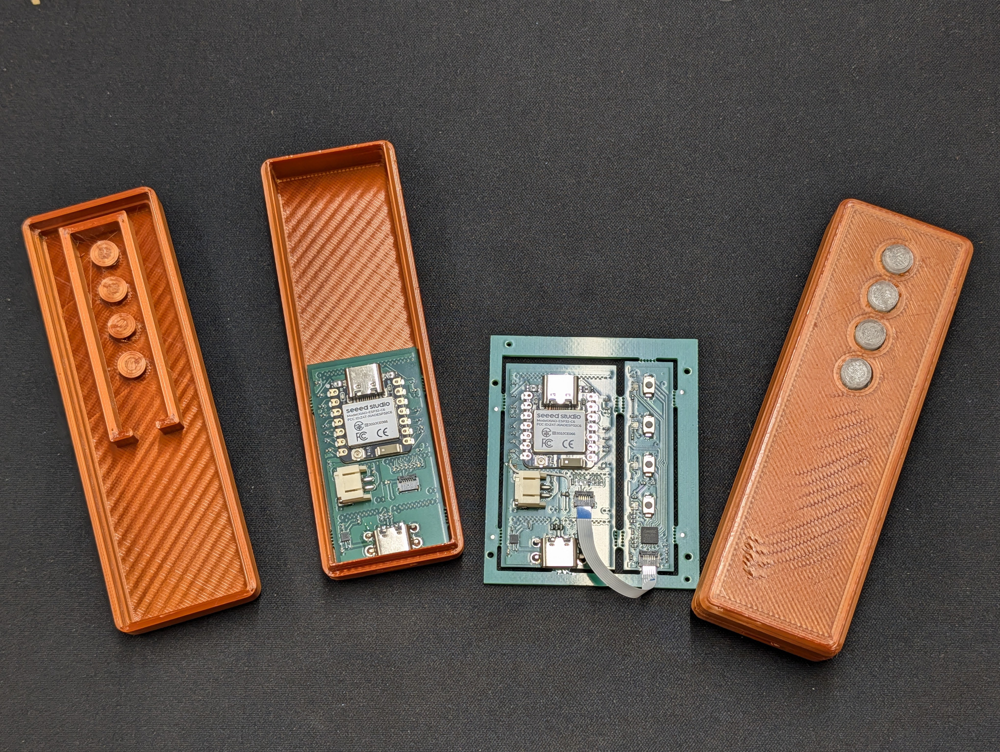

# Blog 46: First Hardware Build - What Went Right, What Went Wrong

**Date: 2026-02-09**

We have a working Bluetooth remote control. It connects, it sends keypresses, the LED lights up. It's real hardware, designed by AI, manufactured at JLCPCB, assembled on a desk in the UK. That part went right.

The rest of this post is about everything that didn't.

## What Went Right

The core thesis held up. PHAESTUS selected blocks from the library, merged them into a single board, panelized it for manufacturing, generated Gerbers, and sent them off to JLCPCB. The boards came back, the components were placed, and after some rework the device turned on and worked.

The 3D-printed enclosure fit. The parametric OpenSCAD design that the AI generated matched the board dimensions, the button cutouts lined up, and the USB-C port landed in the right spot. For a first attempt at AI-generated hardware in a box, that's a win.

The modular block system proved its value too. Main board with MCU, battery, and buttons - connected to a remote button panel via FFC cable. Two separate PCBs, designed independently, working together through the bus interface.

## What Went Wrong

### 1. The Gerber Merge Overlap Bug

This was the most painful one. The merging algorithm uses a 1mm vertical overlap between stacked blocks so that the bus connector pads merge properly between boards. I was paranoid about the buses not connecting, so I erred on the side of too much overlap.

The problem: the MCU block had a 3V3 trace running on an inner layer near its bottom edge. With 1mm of overlap, that trace merged into the ground plane of the battery block below it. A 3V3-to-GND short, buried on an inner layer where you can't see it.

The fix was drilling out three vias to break the short and running a mod wire to restore the 3V3 connection. Not elegant, but functional. The merging algorithm has since been updated to calculate overlap more precisely.

### 2. The Seeed XIAO C6 Wasn't In Stock

Using the Seeed XIAO form factor was a deliberate choice - there's a whole family of pin-compatible boards (nRF52840 for low power BLE, ESP32-S3 if you want a camera, ESP32-C6 for WiFi 6 and Thread). Swap the module, keep the same PCB. Great in theory.

In practice, JLCPCB didn't have the C6 variant in stock. So I ordered a bag of bare modules and hand-soldered them onto the boards myself - LGA pads and all. Thankfully there are no components on the bottom side (the bus connectors occupy that space), so I could use a hotplate for reflow. Years of PCBA rework experience came in handy.

### 3. Wrong USB-C Footprint

The USB-C connector footprint in the block library didn't match the physical part. The pads were off, the mounting tabs didn't line up. I bodged on some connectors I had lying around, but this is exactly the kind of thing that shouldn't happen when the whole point of validated blocks is that they work first time.

### 4. Expensive Manufacturing Choices

Ordering boards within the first 2-3 weeks of starting the project meant making decisions before fully understanding JLCPCB's pricing:

- **V-Score panelization** carries a surcharge. Mouse bites with routed slots are cheaper (even though I personally prefer V-Score for cleaner edges in professional work).
- **0.2mm and 0.4mm drill sizes** are surcharges. Standard JLCPCB drill sizes start at 0.3mm minimum without extra cost.
- **Non-stock passives** - the capacitors and resistors I selected weren't in JLCPCB's standard parts library, so they cost more and added lead time.

These boards were expensive. RIP my bank balance.

## Hardware Is Hard

None of these issues were fatal. Every single one had a workaround. But the goal was 100% perfect, every time - and we're not there yet. That's the gap between "generates manufacturing files" and "generates manufacturing files that come back from the fab and just work."

The pressure of building out the block library, the merger, and the panelizer all within weeks meant cutting corners that cost real money and real rework time. With the competition deadline passed and the pressure off, we can do this properly.

## What's Next

**1. Fix the merger** - Done. The overlap calculation is now precise rather than paranoid.

**2. Fix the blocks for JLCPCB standard design rules:**

- Standard drill sizes (0.3mm minimum), clearances, and trace widths that don't incur surcharges
- Swap V-Score panelization for mouse bites with routed slots
- Map all passives to JLCPCB's standard parts library - basic resistors and capacitors that are in stock and cheap
- Redesign the MCU block - either a homegrown ESP32 design or a WROOM module (which should be stocked at JLCPCB). The XIAO module works great for prototyping but adds cost and stock risk for production. Radio certification, board size, and design effort all factor into this decision.

**3. Expand the library and build cooler things.** The blocks that exist today are enough for simple IoT devices. But I really want:

- A touchscreen block
- A cellular (LTE-M/NB-IoT) block
- More sensor options

Combine touchscreen + cellular + battery and you could build a working phone in 5 minutes. That's the demo I want to show.
