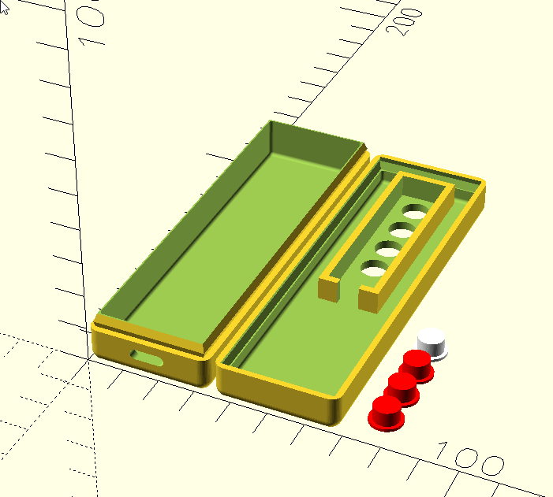
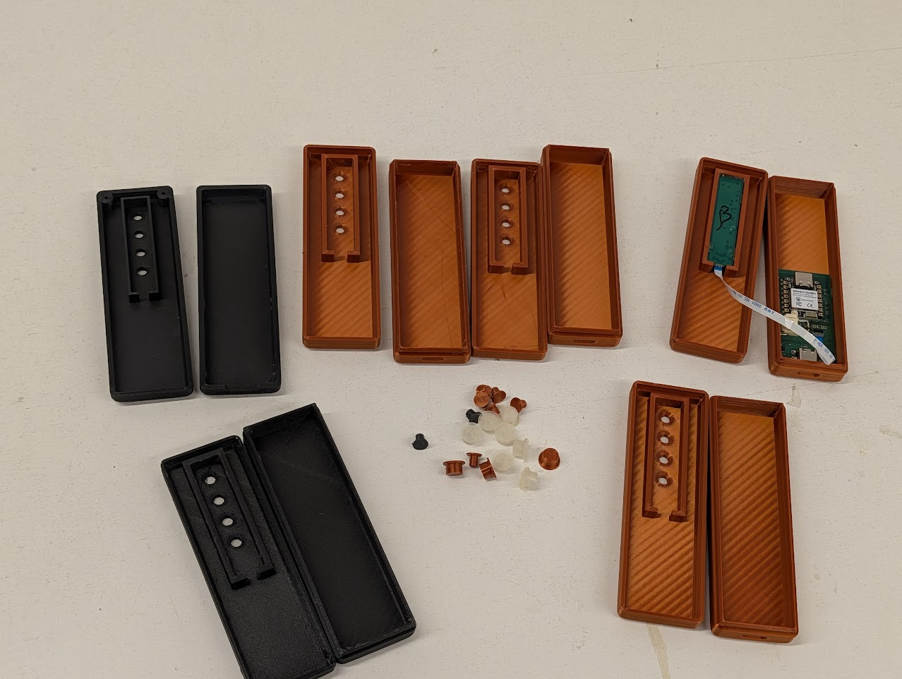

# Blog 47: Enclosure Design - 23 Iterations to a Snap-Fit Case

**Date: 2026-02-11**

The PCB was ordered. The firmware compiled. But a bare circuit board isn't a product. It needs a case - something you can hold, something that protects the electronics, something with holes for buttons and LEDs in the right places. PHAESTUS generates parametric OpenSCAD enclosures from AI prompts, but getting one that actually prints well and snaps together took 23 revisions.



## Design Constraints

Most enclosure tutorials assume you have screws, heat-set inserts, and a decent printer. Our users might have none of those things. The enclosure needed to:

1. **Snap together without fasteners** - no screws, no inserts, no glue. Just print, click, done.
2. **Print on a budget FDM printer** - if it works on a clapped-out Ender 5, it works on anything.
3. **Hold the PCB securely** - the board can't rattle around inside.
4. **Expose the right UI elements** - button holes, LED window, USB-C port.
5. **Be parametric** - dimensions derived from the actual PCB and component measurements, not magic numbers.

## The Snap-Fit Joint

This was the hardest part to get right. A snap-fit joint needs to flex enough to clip together, grip enough to stay closed, and not crack after a few open/close cycles. The geometry that survived all 23 iterations is a profiled lip that runs around the entire perimeter of the case:

```openscad
lip_h        = 3.8;   // Total lip height
lip_thick    = 0.8;   // Wall thickness of the lip
snap_depth   = 0.35;  // How far the bulge protrudes
lap_tol      = 0.2;   // Clearance between male and female
```

The lip profile isn't a simple rectangle. It's a hull of three cross-sections at different heights: straight at the base, bulging outward at 40% height (the snap point), then tapering inward at the top to guide the two halves together. The male lip on the bottom case is 0.2mm smaller than the female socket on the top case - enough clearance to slide together, tight enough to hold.

```openscad
module lip_system(is_cutting=false) {
    active_tol = is_cutting ? 0 : lap_tol;

    difference() {
        hull() {
            lip_slice_shape(expansion=0, z_pos=0, tol_offset=active_tol);
            lip_slice_shape(expansion=snap_depth, z_pos=lip_h * 0.4, tol_offset=active_tol);
            lip_slice_shape(expansion=-0.4, z_pos=lip_h, tol_offset=active_tol);
        }
        // Hollow interior so it's just a shell
        translate([wall + 0.1, wall + 0.1, split_z - 1])
            rounded_box(inner_w - 0.2, internal_l - 0.2, lip_h + 2, 1);
    }
}
```

The bottom case calls `lip_system(is_cutting=false)` to add the male lip. The top case calls `lip_system(is_cutting=true)` to cut the matching female socket. Same geometry, different tolerance. This was revision 15 or so - earlier versions used separate male and female modules that inevitably drifted out of sync.

## Why No Screws

The original designs had screw bosses. They were removed for several reasons:

- **Users might not have M2 screws or heat-set inserts.** We can't assume a hardware kit.
- **Screw bosses eat internal space.** On a case this small (32mm x 106mm), four corner bosses steal significant volume.
- **Alignment is harder.** Screw holes need to line up perfectly between halves. Snap-fits are self-aligning.
- **Print reliability.** Tall thin screw bosses are prone to layer separation. The perimeter lip distributes force evenly.

## PCB Mounting

The main PCB sits on standoffs in the bottom half - just 0.8mm raised pads that prevent the board from touching the case floor. The battery sits underneath it.

The top PCB (the remote button board connected via FFC cable) drops into a retainer pocket in the ceiling of the top case:

```openscad
module top_pcb_retainers() {
    // A rectangular pocket with 2mm walls and 0.3mm tolerance
    // Open at one end for the FFC cable
    difference() {
        cube([top_pcb_w + (wall_thick*2) + pcb_tol,
              top_pcb_l + (wall_thick*2) + pcb_tol,
              wall_h], center=true);

        cube([top_pcb_w + pcb_tol,
              top_pcb_l + pcb_tol,
              wall_h + 1], center=true);

        // Cable slot
        translate([0, -(top_pcb_l/2) - wall_thick, 0])
            cube([cable_slot_w, wall_thick * 4, wall_h + 2], center=true);
    }
}
```

The board just slides in. The retainer walls hold it in X/Y, gravity and the case closure hold it in Z. No clips, no adhesive.

## Button Caps

The buttons needed physical caps that poke through the top case. Each cap is a two-part cylinder - a narrow shaft that passes through the hole, and a wider flange that prevents it from falling out:

```openscad
module button_cap_obj(is_led=false) {
    union() {
        cylinder(h=btn_h, r=btn_cap_r);        // 3.5mm shaft
        cylinder(h=0.8, r=btn_flange_r);        // 4.5mm flange
    }
}
```

The hole tolerance is 0.35mm per side. Too tight and the buttons stick. Too loose and they wobble. This was one of the things that needed physical test prints to get right - no amount of CAD preview tells you how a 0.35mm clearance feels when you press a button.

## The Printer Situation

The design was optimised to print on my Ender 5 - a printer that, to be charitable, had seen better days. Before any enclosure could be printed, the printer itself needed:

- A new extruder (the original was grinding filament)
- New nozzles (worn out, inconsistent extrusion)
- A fan upgrade (poor cooling meant droopy overhangs)
- A filament dryer (wet PLA was causing stringing and layer adhesion issues)

In hindsight, I should have just bought a Bambu printer. The time and money spent resurrecting the Ender probably exceeded the cost of a new A1 Mini. But the upside is that if the enclosures print acceptably on a machine this rough, they'll print fine on basically anything modern.



The photo tells the story. Black prints from the early iterations, copper prints from later ones. A pile of button caps in various colours. Each iteration tweaked something - the snap was too tight, the snap was too loose, the button holes were off-centre, the USB cutout was too small, the retainer walls were too thin. 23 versions to get to something that clips together firmly, holds the board, and doesn't need a single screw.

## What This Means for PHAESTUS

The final OpenSCAD code is now a reference design for the AI enclosure generator. When PHAESTUS generates enclosures for future projects, the prompt includes something to the effect of: "here's a working snap-fit geometry that's been validated on a real printer - use these exact parameters, don't reinvent them."

The key numbers that survived testing:

| Parameter             | Value  | Why                                                  |
| --------------------- | ------ | ---------------------------------------------------- |
| Wall thickness        | 2.4mm  | Stiff enough for snap-fit, printable in 3 perimeters |
| Snap depth            | 0.35mm | Enough grip without cracking                         |
| Lip height            | 3.8mm  | Enough engagement for a secure hold                  |
| Lap tolerance         | 0.2mm  | Works on poorly-calibrated printers                  |
| Button hole tolerance | 0.35mm | Smooth actuation, minimal wobble                     |
| PCB tolerance         | 0.3mm  | Easy board insertion, no rattle                      |
| Corner radius         | 3mm    | Comfortable to hold, prints without artifacts        |

These aren't theoretical values. They're the result of printing, testing, adjusting, and reprinting until the case worked. That's the kind of validated knowledge that makes AI-generated enclosures actually manufacturable, rather than just dimensionally correct on screen.
