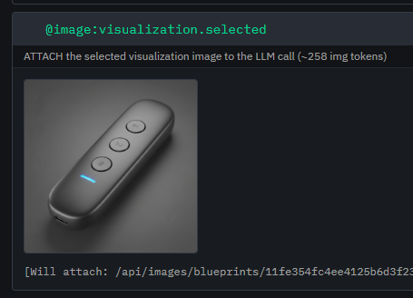
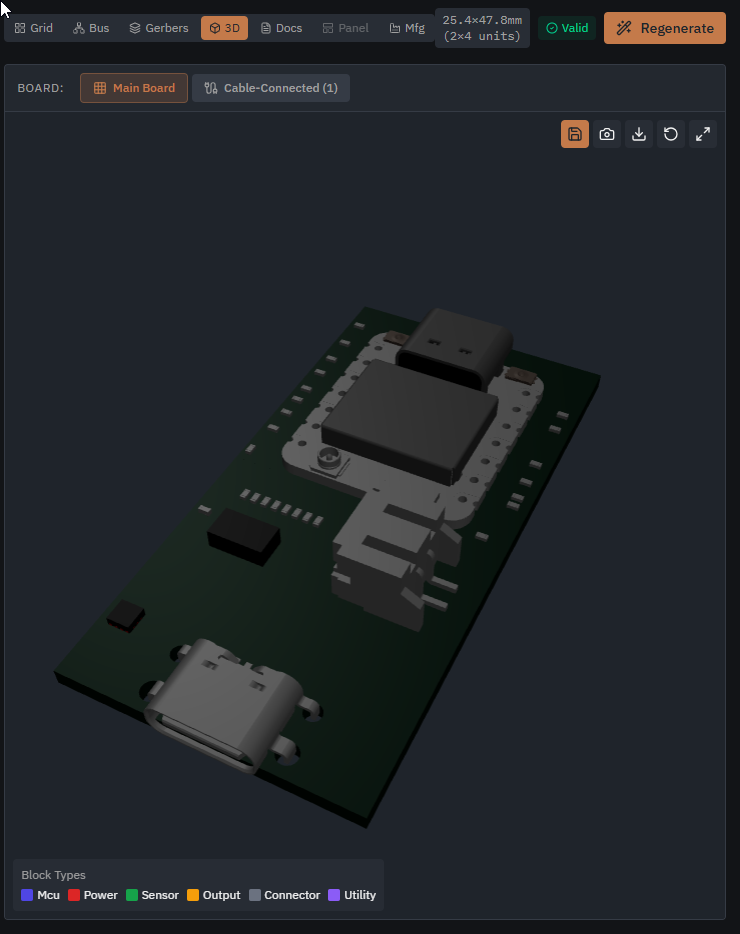
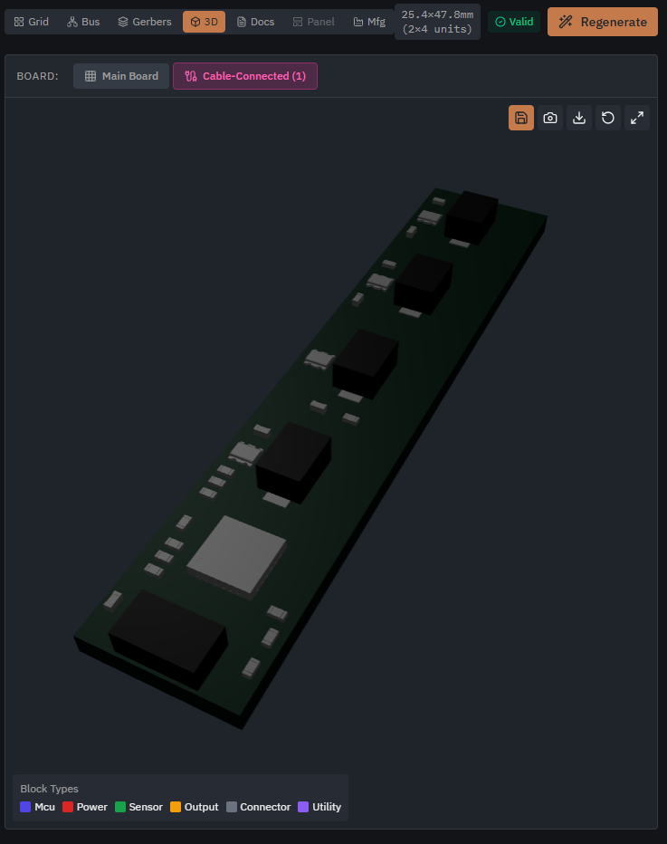
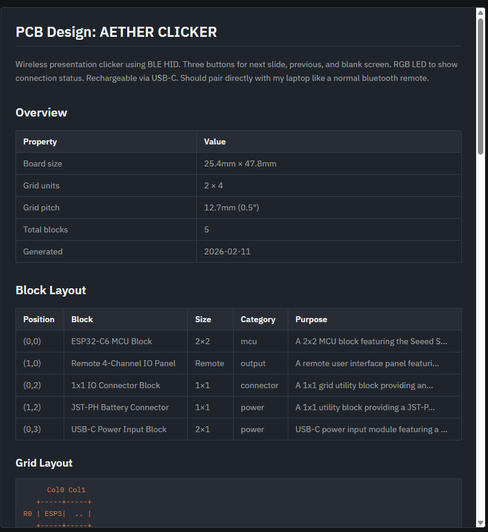

# Blog 48: How AI Generates a 3D-Printable Enclosure from a Product Blueprint

**Date: February 11, 2026**

Blog 47 covered the physical side - 23 iterations of printing snap-fit cases until the tolerances worked. This post is about the other half: how PHAESTUS gets from "here's what the product should look like" to valid, printable OpenSCAD code, entirely through LLM prompting.

## The Problem

An enclosure isn't just a box around a PCB. It needs:

- Cutouts in the right places for USB-C, buttons, LEDs, displays
- Mounting features that match the actual board dimensions
- A split line so it can be printed as two halves
- Snap-fit or screw features so it stays together
- Tolerances that work on real printers

The AI has to figure all of this out from context: the selected product visualization, the PCB layout, the board dimensions, and the block placement map. No manual CAD. No templates. Just a prompt and some images.

## Why Gemini 3

PHAESTUS was originally built for a Google Gemini 3 hackathon, and the enclosure stage is where the model choice matters most. Generating a 3D-printable case from a product photo is fundamentally a multimodal spatial reasoning problem - the model needs to look at a blueprint image, understand the 3D form factor, cross-reference PCB renders to figure out where connectors sit, and then output geometrically correct code.

Gemini 3's multimodal capabilities are best-in-class for this. It processes the blueprint image, the PCB 3D views, and the text specification in a single call, and its spatial reasoning is strong enough to map visual features to physical coordinates. Earlier models would frequently confuse left/right or put cutouts on the wrong face. Gemini 3 gets this right far more often - not perfectly, which is why the validation loop exists, but often enough that the first attempt is close.

The hackathon ended, but we haven't swapped to a different model. It just works. The multimodal input pipeline, the code generation quality, the spatial awareness - there's no compelling reason to change something that's producing printable enclosures on the first or second pass.

## Prompt Architecture

The enclosure prompt is stored in the database as part of the orchestrator system, not hardcoded in the frontend. This means it can be iterated without redeploying. The prompt has two variants:

**Vision mode** (primary) - when a blueprint image exists from the design stage, the LLM gets the image and generates geometry that matches the visual design intent.

**Text mode** (fallback) - when no blueprint is available, the LLM works from the text specification alone.

The prompt uses template variables that get expanded at runtime with actual project data:

```
@availableBlocks          → The full block library (what components exist)
@image:visualization.selected → The user's chosen product render
@feasibility.suggestedRevisions.revisedDescription → What the product does
@image:pcb.assembly3d    → 3D render of the main PCB
@pcb.placedBlocks        → Which blocks are placed and where
@pcb.boardSize           → Exact board dimensions in mm
@image:pcb.remoteTypeAssembly3d → 3D render of the remote board (if any)
```

The `@image:` variables are the interesting ones. They don't inject text - they attach actual images to the multimodal LLM call. The system resolves each image reference to a URL in R2 storage and includes it as a vision input alongside the text prompt.



So the LLM sees three things simultaneously: the product blueprint (what it should look like), the main PCB 3D view (what it needs to contain), and the remote board (if buttons or LEDs are on a separate cable-connected board).

## What the LLM Actually Sees

For a project like the "Aether Clicker" (a wireless presentation remote), the prompt expands to include:

**The blueprint** - a rendered image of a slim handheld remote with three buttons and an LED strip. This gives the LLM the intended form factor, proportions, and aesthetic.

**The main PCB** - a 25.4 x 47.8mm board (2x4 grid units) with an ESP32-C6 module, USB-C connector, JST battery connector, and a piezo buzzer.



**The remote board** - a long narrow strip with four tactile buttons and the AW9523B GPIO expander, connected via FFC cable.



**The PCB documentation** - exact block positions, grid coordinates, board dimensions, and component categories.



One important detail in the prompt: "despite what the visualization may say, the 'remote' board goes inside the enclosure." The product blueprint might show buttons on the case surface, but the actual implementation uses a separate PCB mounted inside the lid. The LLM needs to reconcile the visual intent with the physical reality.

## The Guidelines

The prompt includes specific constraints learned from experience:

```
- Use mm as the unit
- Include wall thickness, clearance, and tolerance parameters
- Create mounting posts for PCB
- Add cutouts for connectors and displays
- Use hull() and difference() for smooth shapes
- Add snap-fit features or screw posts for lid attachment
- Do NOT use text() function - fonts are unavailable in WebAssembly
```

That last one is important. The OpenSCAD renderer runs as WASM in the browser (more on that below), and the WASM build doesn't have access to system fonts. Early iterations kept trying to emboss product names onto the case, which caused silent render failures.

The prompt also asks the LLM to design in two parts - a bottom hull with PCB mounting and connector cutouts, and a top hull with apertures for buttons and LEDs. This isn't just good practice; it's necessary for FDM printing without supports.

## The Reference Design

This is where blog 47's work pays off. The prompt now includes reference geometry from the validated snap-fit case - the exact parameters that survived 23 print iterations:

```openscad
lip_h        = 3.8;   // Total lip height
lip_thick    = 0.8;   // Wall thickness of the lip
snap_depth   = 0.35;  // How far the bulge protrudes
lap_tol      = 0.2;   // Clearance between male and female
```

Instead of letting the LLM invent snap-fit geometry from scratch (which it will, and it'll be wrong), we say: "here's a working snap-fit that's been validated on a real printer - use these parameters." The LLM still generates the overall shape, cutout positions, and mounting features, but the joint geometry comes from tested values.

Wall thickness (2.4mm), corner radius (3mm), PCB tolerance (0.3mm), button hole tolerance (0.35mm) - all injected from proven designs rather than hallucinated by the model.

## The Automated Review Loop

Generating OpenSCAD code isn't enough. LLMs make consistent mistakes with 3D geometry - floating parts that don't connect, cutouts that don't penetrate walls, thin features that can't print. So we run the generated code through a second LLM pass: an automated reviewer.

The reviewer checks five categories:

**Geometry problems** - Floating geometry from `union()` operations where parts don't overlap. Cutouts using `center=true` that don't fully intersect walls. Parts extending below z=0. `difference()` operations where the cutter doesn't extend past the target.

**Printability issues** - Overhangs greater than 45 degrees. Walls thinner than 1.2mm. Holes smaller than 2mm that close up during printing. Sharp internal corners that trap resin or cause stress concentrations.

**Assembly problems** - Snap-fit parts without adequate tolerance (need 0.3-0.5mm). Sealed cases with no way to open them. PCB insertion paths blocked by other features.

**Functional issues** - USB cutout misaligned with the actual connector position. Display windows that don't match the active area. LED holes too small to pass light.

**Code quality** - Use of `text()` (breaks in WASM). Missing `$fn` on circles. Undefined variables. Magic numbers that should be parameters.

The reviewer outputs a structured JSON assessment with severity levels (critical, warning, suggestion) and specific fix instructions. If critical issues are found, the code goes through an automated fix pass - another LLM call that receives the original code plus the issue list and generates corrected code. This loops until validation passes or hits a maximum iteration count.

The temperatures are deliberately different: 0.3 for generation (some creativity needed for form factor), 0.2 for validation and fixing (deterministic corrections).

## Rendering in the Browser

The generated OpenSCAD code renders entirely client-side using an OpenSCAD WASM build. No server needed. The renderer:

1. Loads the WASM module from `/openscad/openscad.wasm`
2. Writes the generated `.scad` code to a virtual filesystem
3. Calls the OpenSCAD main function with STL output
4. Returns the binary STL for the 3D viewer

There are two rendering backends: **CGAL** (robust, handles complex geometry, slow) and **Manifold** (fast, roughly 100x faster, but can fail on tricky geometry). The system defaults to CGAL for robustness and falls back to Manifold when speed matters, like during the iterative preview cycle.

## Visual Comparison (Optional)

There's an additional validation step that compares the rendered 3D model back to the original blueprint image. The system takes a screenshot of the STL render and sends both images to the LLM: "does this enclosure match the intended design?"

It scores on form factor, feature placement, visual style, and assembly. If the score drops below 70, it suggests specific OpenSCAD modifications - "the case is too boxy compared to the rounded blueprint" or "the button spacing doesn't match the visualization."

This closes the loop: blueprint image in, OpenSCAD code out, rendered STL back, compared to original blueprint.

## What Goes Wrong

Despite all this, the system isn't perfect. Common failure modes:

**Spatial reasoning** - Gemini 3 is significantly better at this than previous models, but it's not infallible. It'll occasionally put a USB cutout on the wrong edge, or calculate an offset from the wrong corner. The PCB documentation with explicit grid coordinates helps, but the model sometimes confuses X and Y.

**Overcomplication** - Given creative freedom, the LLM will add decorative chamfers, ventilation patterns, and cable management channels that aren't needed. The review pass catches some of this, but "unnecessary complexity" isn't always flagged as an error.

**Manifold failures** - Occasionally the generated geometry is technically valid OpenSCAD but produces non-manifold meshes that can't be sliced. The CGAL backend handles this better than Manifold, which is why it's the default despite being slower.

**Scale drift** - The LLM sometimes generates an enclosure that's dimensionally correct but aesthetically wrong - too thick, too boxy, nothing like the sleek blueprint. The visual comparison catches this, but fixing it requires regeneration rather than a targeted patch.

## The Full Pipeline

Put it all together:

1. User selects a product blueprint during the design stage
2. PCB is generated with exact dimensions and block positions
3. Enclosure prompt assembles: blueprint image + PCB 3D renders + board specs + reference geometry
4. LLM generates OpenSCAD code (vision or text mode)
5. Automated reviewer checks for geometry, printability, assembly, and functional issues
6. Fix loop runs until validation passes
7. WASM renderer produces STL in the browser
8. Optional visual comparison scores the result against the blueprint
9. User can iterate with natural language feedback ("make it rounder", "move the USB cutout down")

From a user's perspective: they described a product in English, picked a design that looked good, and got a 3D-printable enclosure that fits their specific PCB. The prompt engineering, validation loops, and reference geometry all happen behind a single "Generate Enclosure" button.

The gap between "looks right in CAD" and "prints correctly on a budget printer" is where blog 47's 23 iterations live. The gap between "user wants a case" and "valid OpenSCAD code" is where this blog's prompt architecture lives. Both are necessary. Neither is sufficient alone.
